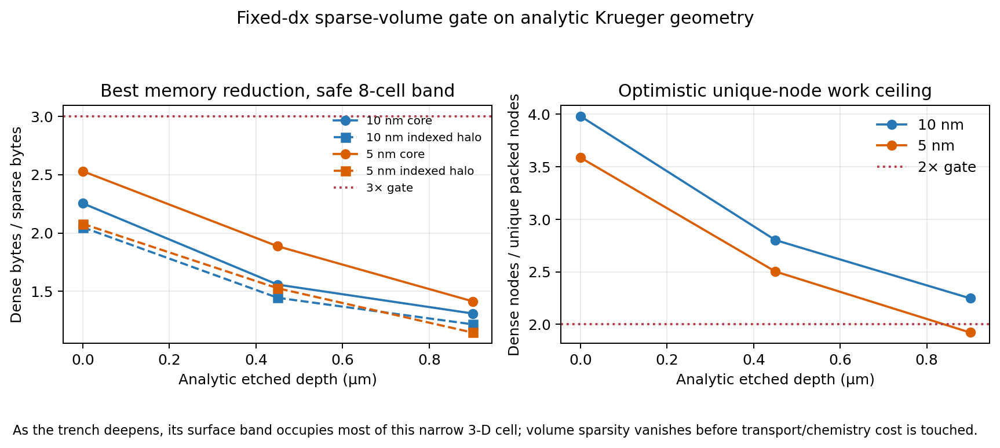

# Fixed-spacing sparse-volume Krueger audit

Date: 2026-07-17

Evidence class: numerical/storage verification only. No profile evolution, experimental outcome,
calibration, or held-out observation was read.

## Question

Would a ViennaHRLE-like fixed-resolution sparse narrow band make the current Krueger validation run
materially cheaper before we build its advection, redistance, surface extraction, and checkpoint
kernels?

The predeclared gate in `AMR_IMPLEMENTATION_AUDIT_2026-07-17.md` requires at least 3x geometry-memory
reduction and a plausible 2x level-set-stage work reduction on a representative deep feature. This is
a gate on the method, not a target to optimize after the fact.

## Implemented reference

`src/petch/block_levelset_3d.py` now provides a standalone, immutable fixed-`dx` authority with:

- deterministic lexicographic active/far blocks and partial boundary blocks;
- exact interface/material-junction storage plus a declared buffered band;
- unambiguous far-gas or far-material labels;
- periodic block neighbors and duplicate-endpoint canonicalization with a priced discrepancy;
- replicated reference halos and a lower-memory sorted unique-node/indexed halo layout;
- stable fingerprints and explicit storage/work receipts.

It is not wired into `advance_feature_step_3d`. The uniform solver remains authoritative.

## Bounded protocol

The audit evaluated 72 analytic geometries:

- uniform spacings: 10 and 5 nm;
- etched depths: 0, 450, and 900 nm;
- band half-widths: 4, 8, and 12 cells;
- four domain-compatible block shapes per case;
- one-cell stencil halo;
- exact interface/material comparison against the dense source.

The safe decision slice is the predeclared 8-cell band at 5 nm and 900 nm depth. All 72 integrity
checks pass. The 5 nm periodic endpoint construction differs by `2.862e-12` mesh units, or
`5.724e-10` cells; it is verified, canonicalized, and reported rather than mistaken for topology.

## Result

| Deep 5 nm quantity | Best observed | Gate |
| --- | ---: | ---: |
| core sparse-memory reduction | 1.415x | >=3x |
| indexed halo-only memory reduction | 1.148x | >=3x |
| simultaneous core + indexed payload reduction | 0.634x | >=3x |
| optimistic unique-node work ceiling | 1.921x | >=2x |

The dense 5 nm state in this narrow periodic cell is only 75,735 nodes (`2.42 MB` for combined
distance, two material distances, and owner). As the trench deepens, its walls and floor place about
two-thirds of the block slabs inside the exact surface band. Sparse-volume opportunity disappears
before it can affect the surface triangles, ballistic transport, radiosity, or chemistry.

## Decision and scope

`fixed_dx_sparse_no_go_for_krueger`.

Do not implement or wire fixed-`dx` sparse advection/redistance kernels for this benchmark. This is
not a universal rejection of sparse level sets: ViennaHRLE remains appropriate for large domains with
small interface bands. It is a geometry-specific result for the very narrow Krueger cell, where the
measured live runtime is already dominated by chemistry/material routing (`29.5%`), ballistic
transport (`28.8%`), diffuse exchange (`15.3%`), and surface remap (`13.7%`), while redistance is
`0.8%`.

Retain the verified block authority as infrastructure for a future large-domain AMR use case. Hold
one-level 10/5 volume AMR for Krueger until a cost model can beat this no-go; keeping the complete
interface fine is subject to the same surface-band occupancy.

The earned speed/accuracy path is instead:

1. close the bounded 5 nm common-refinement versus indexed-remap gate on a ready cached GPU;
2. exploit declared line-extrusion symmetry for Krueger and Nozawa/Hwang line-pattern cases, while
   reusing the same boundary, surface mechanism, ledgers, and observables;
3. reduce or adapt surface/transport work—the quantities that dominate the measured step;
4. retain full 3-D transport for holes, asymmetric masks, twisting statistics, and any case that
   fails the symmetry validity reporter.

Machine receipt: `results/block_levelset_manufactured_audit_3d/audit.json`.
