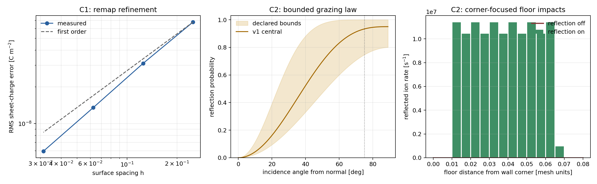

# Charging co-evolution C1/C2 audit

Date: 2026-07-13. This report implements the C1/C2 work completed before convergence-contract
sign-off in the charging co-evolution handoff. Revision `CCA-2026-07-13-R2` was subsequently signed
on 2026-07-13, authorizing C3 subject to its full entry gates and no-gos. This report contains no C3
result.

## Outcome

- **C1 passes its bounded engineering gates.** Signed material-surface charge now transfers between
  old and new triangle meshes with a declared v1 closure: charge rides retained/advancing material;
  charge on an etched-away layer is removed and itemized; newly exposed material starts uncharged.
  Positive and negative inventories are conserved separately, so a near-zero net charge cannot hide
  a large ledger error.
- **C2 passes its channel-certification gates.** A material-tagged, angle-dependent specular ion
  reflection sensitivity produces explicit weighted outgoing ions, retains their source/event
  lineage, and reuses the production full-field charged tracer. Every landed re-impact is merged into
  the chemistry-facing energetic impact measure. An incomplete bounce cascade is refused rather than
  truncated.
- **C2 is not a calibrated reflection prediction.** Its three parameters and bounds are explicit
  literature-bounded sensitivity inputs. The result earns a common-engine mechanism and a qualitative
  corner-focusing gate, not a universal Si/SiO2 differential-scattering claim.

## C1 — conservative charge remap

Production operator: `src/petch/surface_charge_remap_3d.py::remap_surface_charge_3d`.

The operator consumes old/new triangle meshes, old face sheet charge, old/new material ids, and the
old faces' signed material-normal displacement. The exact no-motion path returns the original sigma
array bitwise. Unchanged connectivity carries each face's charge Lagrangianly. A changed mesh uses a
material-local inverse-distance reconstruction and then rescales positive and negative densities
separately to the exact retained inventories. Removed old-face charge is returned face by face and by
material.

| Refinement cells | New faces | RMS sigma error (C/m2) | Observed order | Relative ledger error |
| ---: | ---: | ---: | ---: | ---: |
| 4 | 128 | 6.789e-8 | — | 2.12e-16 |
| 8 | 512 | 3.116e-8 | 1.124 | 6.35e-16 |
| 16 | 2,048 | 1.352e-8 | 1.204 | 1.27e-15 |
| 32 | 8,192 | 5.937e-9 | 1.187 | 1.48e-15 |

Manufactured gates also pass for bitwise no-op, rigid translation with exact charge carry, and
uniform recession with exact positive/negative removal ledger. The observed convergence is
first-order, consistent with a piecewise-constant face field and the existing first-order moving
interface/state-transfer contract.

This operator is intentionally solver-independent and was not called by a C3 profile/charging loop
in this audit. Revision `CCA-2026-07-13-R2` subsequently authorized that wiring.

## C2 — energetic grazing reflection

Production model: `GrazingSpecularIonReflection3D`.

The declared v1 probability is

`P_reflect = p_grazing * (1 - cosine_incidence ** angular_exponent)`.

The central sensitivity is `p_grazing=0.95`, exponent `3`, and energy retention `0.90`, with declared
bounds `[0.80, 1.00]`, `[2, 8]`, and `[0.50, 0.99]`. These bounds cover the high grazing reflection
and retained-energy regimes used or observed in the cited MD/profile studies; they do not replace a
material-, energy-, roughness-, and coverage-resolved table. Helmer and Graves reported MD reflection
probabilities above 90% for most 75-degree-and-higher impacts on Si, while Hoekstra et al. found that
microtrench reproduction required greater than 90% reflection above 80 degrees and used up to 99%
energy retention. Modern MD confirms strong angle, energy, and material dependence.

Sources:

- [Helmer and Graves 1998](https://doi.org/10.1116/1.580993)
- [Hoekstra et al. 1998](https://cpseg.eecs.umich.edu/pub/articles/jvstb_16_2102_1998.pdf)
- [Du et al. 2022](https://cpseg.eecs.umich.edu/pub/articles/JVSTA_40_053007_2022.pdf)

Certification results at 100 eV and cosine incidence 0.1 (84.26 degrees from normal):

| Gate | Result |
| --- | ---: |
| Reflected probability | 0.94905 |
| Incident / reflected / locally deposited rate | 1.280e8 / 1.214784e8 / 6.5216e6 s-1 |
| Particle balance error | 0 |
| Surface-response charge balance error | 2.37e-15 |
| Surface-response kinetic-energy balance error | 0 |
| Reflected-flight particle balance error | 0 |
| Straight-wall events landing on floor | 128 / 128 |
| Landing distance from wall/floor corner | 0.0101–0.0653 mesh units |
| Reflection-off floor re-impact rate | 0 |

Specular direction preserves the tangential component exactly. Reversing a certified wall-to-floor
flight returns to the source wall within the explicit geometric launch-offset bound. Collisionless
flight in a nonzero field continues to use the existing electrostatic-work refinement gate; kinetic
energy is not incorrectly required to remain constant while a charged particle exchanges energy with
the field.

`augment_transport_with_charged_reimpacts_3d` concatenates primary and landed re-impact events by
species without histogramming. The existing surface mechanisms therefore see the reflected floor
ions with their actual lower energy and incidence angle. Boundary hit/escape probabilities remain
defined for boundary-launched particles only and are labeled accordingly.

## Reproduction and evidence

Run config hash: `b3df9406a4ac848dafa410eee924ca587217a39fef22065dfc70e6b998c1ed5d`.

The replay script is `scripts/audit_charging_coevolution_c1_c2.py`. Its JSON manifest records the base
git revision, source SHA-256 values (including uncommitted implementation content), numerical settings,
CPU/Python platform, deterministic sampling declaration, exact hard-triangle visibility, parameter
provenance/bounds, and all conservation gates. Outputs are under
`results/charging_coevolution_c1_c2/`.

## Boundary after this report

C1 and the bounded C2 channel passed their pre-C3 review. Signed revision
`CCA-2026-07-13-R2` separately authorizes C3; it does not alter this report's evidence. The old
frozen-map root solver family remains closed, the per-node diagnostic remains mandatory on every
run, and no result here claims charging convergence, notching validation, twisting prediction, or
calibrated ion scattering.
