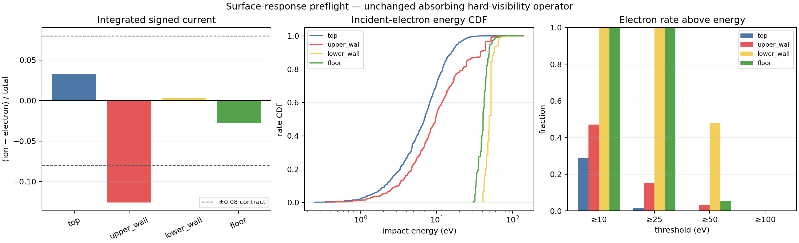

# Charging physics closure audit

Date: 2026-07-13. This follows, but does not replace, the numerical campaign in
`CHARGING_SOLVER_CAMPAIGN_2026-07-13.md`.

## Outcome

The remaining charging failure should no longer be treated as a request for another nonlinear
solver. The engine has reached a timestep-refined, nearly globally balanced physical-time state with
coherent local wall currents that survive grid and sample refinement. The current operator is still
an absorbing first-hit model: every landed charged particle deposits its full charge, and deposited
charge can only be neutralized in place by a later opposite charge. Reflection, secondary-electron
emission (SEE), lateral surface transport, and bulk conduction are absent.

The next engine capability should be a **material-tagged charged-surface response and conservative
charged re-impact loop**. It must be shared by physical time, PTC, steady diagnostics, and future
profile evolution. Ion-induced SEE is the best first validation slice because a plasma-exposed SiO2
fit is available, but it is not expected to close the wall residual alone. Electron backscatter and
electron-induced SEE are the physically stronger closure; they require a richer impact event and
material data before implementation. Bulk leakage is held by a timescale screen. Surface conduction
is held until a declared SiO2 or fluorocarbon-layer conductivity is available.

No convergence claim changes. The final operator must still pass the existing RMS and worst-node
contract, independent audit, timestep/sample/grid refinement, and exact-operator statement.

## What the engine already has

| Capability | Production primitive | What is already conserved / reusable |
| --- | --- | --- |
| Charged trajectories | `boundary_transport_3d.py` | Full-field collisionless ion/electron motion, hard triangle hits, electrostatic work refinement, escape/truncation classification |
| Incident surface measure | `FaceResolvedEnergeticFlux` | Species, face, event weight, impact energy, incidence cosine; bidirectional estimator selection is independently certified and frozen for scoring |
| Electrostatics | `NodalPoissonSystem3D` | Variable-permittivity Q1 Poisson factorization, exact charge-to-voltage response, Dirichlet reservoirs explicit |
| Charge deposition | `advance_dielectric_charging_3d` | Signed face current, compatible Q1 projection, deposited charge equals integrated incident charge to roundoff |
| Physical time | `integrate_dielectric_charging_transient_3d` | Fixed-step conservative ODE, complete initial/pre-step/final history, timestep-halving contract |
| Direct steady diagnostic | `solve_dielectric_charging_steady_3d` | Physical current residual and confidence envelope; Picard/Anderson variants exist but are closed on the present frozen unsmoothed map |
| Surface emission precedent | `neutral_radiosity_3d.py`, `surface_exchange.py` | Source/landing/escape accounting and repeated diffuse re-impact for uncharged, field-free products |
| Material identity | `feature_step_3d.py` | Volume and face material ids already survive geometry extraction and conservative state remap |

The neutral radiosity solver supplies the accounting pattern, not the charged flight operator.
Charged secondaries must traverse the same electric field as primary electrons, so using the
energy-independent neutral form-factor matrix would be physically wrong.

## What the current model actually solves

For the present engine, the local stored charge equation is only

`dQ/dt = I_ion,absorbed - I_electron,absorbed`.

There is no term that transports already deposited charge and no outgoing charged population. The
2019 MCFPM description uses the same surface deposition idea but also provides a general material
mobility term in the charge-continuity equation and assigns dielectric constants and positive/negative
mobilities by material. Its Poisson solve is updated after batches of impacts. That is architectural
support for a material charge-continuity operator, not permission to invent a conductivity value for
petch. [Huang et al. 2019](https://cpseg.eecs.umich.edu/pub/articles/JVSTA_37_031304_2019.pdf)

With surface response, charge accounting must become

`dQ_surface/dt = sum(q_in * rate_in) - sum(q_out * rate_out) - div_s(J_surface) - J_bulk_to_reservoir`.

This identity handles all cases without sign conventions hidden in branches:

- absorbed electron: `-e` deposited;
- one reflected electron: `-e - (-e) = 0` deposited;
- absorbed electron plus `m` true secondaries: `(m - 1)e` deposited;
- neutralized singly charged ion plus `m` emitted electrons: `(1 + m)e` deposited.

Every emitted or reflected electron must then be traced to another face or to an explicit escape
reservoir. Internal re-impact transfers charge but cannot change the combined surface-plus-particle
charge.

## New exact-map preflight

Config hash: `6fdaa46785f8f9f861a2b6aece83cb5d5282814839f0cdb570af13af6fc08e94`.

`scripts/charging_surface_response_preflight_3d.py` replays the archived 15 microsecond state using
the separately frozen ion estimator map, level-11 scoring, the exact hard-visibility trajectories,
and the unchanged absorbing current law. It retains the incident event energies that previous
campaign summaries discarded. No response was applied to charge or transport.



| Region | Integrated signed imbalance | Electron mean / median energy | Electron rate >=25 eV | Ar+ kinetic SEE diagnostic |
| --- | ---: | ---: | ---: | ---: |
| top | +0.032 | 8.0 / 6.9 eV | 1.5% | 0.065 |
| upper wall | **-0.126** | 14.4 / 9.7 eV | 15.2% | 0.052 |
| lower wall | +0.003 | 49.8 / 49.0 eV | 100% | 0.031 |
| floor | -0.030 | 41.1 / 40.7 eV | 100% | 0.036 |

The ion SEE column is the event-weighted kinetic-emission fit from Eq. 8 of Sobolewski's in-situ
plasma-exposed SiO2 study. It is a diagnostic, not an applied yield. The paper explicitly separates
kinetic Ar+ emission from photon, metastable, and potential-emission contributions; those absent
incident populations must not be silently folded into an ion-only constant.
[Sobolewski 2021](https://tsapps.nist.gov/publication/get_pdf.cfm?pub_id=926240)

Interpretation:

1. The integrated failure is spatially specific, not global. Upper-wall absorption is the only
   four-region value outside the contract.
2. A global electron-current multiplier would damage already-balanced lower regions.
3. The NIST ion-emission fit predicts about 5.2% emitted electrons per upper-wall ion. Even before
   re-impact, that is smaller than the local electron excess and is unlikely to close the gate alone.
4. The electron energy distribution is strongly nonlocal: the 4 eV source electrons reach the lower
   wall and floor near 40--50 eV after field acceleration. A response must consume impact energy,
   not source temperature or local voltage.
5. The existing impact record lacks the full incident direction vector. Incidence cosine is enough
   for diffuse emission, but not for a physical specular/backscatter law. Direction preservation is
   therefore an engine prerequisite, not campaign bookkeeping.

## Literature screen

### Secondary electrons and backscatter: promote, with separate channels

The 2026 MCFPM study treats electron backscatter and true secondary emission as independent events,
with material-, energy-, and angle-dependent response. Backscatter largely preserves primary energy;
true secondaries are mostly below 5 eV and are launched with a Lambertian distribution. The emitted
electrons are transported through the feature field and can move negative charge from upper regions
to deeper positive regions. The authors find electron-induced SEE dominates ion-induced SEE in their
HAR cases. [Huang and Kushner 2026](https://cpseg.eecs.umich.edu/pub/articles/JVSTA_44_023013_2026.pdf)

This is directionally matched to petch's upper-wall negative mode, but their AR 16.7--50 features and
hundreds-of-volt potentials are not petch's AR 1.5, 44 V case. Their result promotes the mechanism,
not their outcome or parameter values. The paper's electron-yield formula refers to external material
parameters that have not yet been independently recovered. Do not transcribe a curve from a plot or
reuse the legacy PMMA model as SiO2.

In-situ measurement confirms that electron elastic reflection at a plasma-exposed fused-quartz
surface is a real and separately measurable channel over 25 eV--1.2 keV. It does not cover most of
petch's upper-wall distribution below 25 eV, so it cannot yet parameterize the whole response.
[Sobolewski 2023](https://doi.org/10.1088/1361-6595/ad1623)

### Surface conduction: physically credible, data-gated

Published oxide-etch work explicitly links sidewall conduction to charging, and on-wafer monitoring
studies identify fluorocarbon polymer deposited on HAR sidewalls as an electrically relevant layer.
This supports surface-state-dependent conduction in the product engine, not a numerical smoothing
filter. [Matsui et al. 2001](https://doi.org/10.1088/0022-3727/34/19/304),
[Jinnai et al. 2007](https://scholar.nycu.edu.tw/en/publications/on-wafer-monitoring-of-charge-accumulation-and-sidewall-conductiv/)

The existing `charging_general.py` cryogenic conduction and uniform-filter leakage are heuristics and
must not be promoted. A real implementation needs sheet conductivity with material/surface-state,
temperature, field, and provenance, followed by a conservative surface finite-volume operator and
mesh refinement.

### Bulk leakage: hold by timescale

The Maxwell relaxation time is `tau = rho * epsilon`. Even taking the low end of published hot-silica
resistivity, `rho = 1e12 ohm m`, and `epsilon_r = 3.9` gives roughly 35 seconds, more than two million
times the 15 microsecond transient. Room-temperature high-purity silica is more resistive. Bulk
leakage is therefore not a plausible first explanation unless plasma damage, contamination, or a
conductive deposited layer changes the material by many orders of magnitude.
[Shin and Tomozawa 1993](https://doi.org/10.1016/0022-3093(93)90769-T)

This screen does not rule out lateral conduction in a fluorocarbon-rich surface layer; that is a
different geometry and material.

## Unified engine design

```text
PlasmaBoundaryState
        |
        v
full-field charged transport -----> FaceResolvedChargedImpact
                                          |  material id + surface state
                                          v
                                  ChargedSurfaceResponse
                                  /          |          \
                         deposited Q   reflected e-   true SEs
                              |              \          /
                              v               v        v
                    charge continuity   full-field re-impact loop
                    /       |       \            |
             deposition  surface J  bulk J       +--> escape reservoir
                    \       |       /             |
                     compatible Q1 charge <-------+
                              |
                           Poisson
                              |
                  physical time / PTC / audit
```

The following should be one engine path:

1. Add a richer immutable charged-impact measure that preserves face, event rate, species/charge,
   energy, full incident direction, and estimator provenance. Existing
   `FaceResolvedEnergeticFlux` remains a chemistry projection of that measure.
2. Add a material-tagged `ChargedSurfaceResponse` input contract. It returns deposited charge and
   explicit outgoing charged populations; it never edits a current residual.
3. Add surface-origin charged tracing by reusing the same field integrator and periodic hard-hit
   geometry used for primary particles. Reflection/SEE cascades terminate only by absorption,
   escape, or a declared statistically unbiased roulette; a hard bounce cap may diagnose but not
   discard charge.
4. Project the net surface charge transfer once through the existing compatible Q1 deposition.
5. Express optional surface conduction as a conservative tangential flux divergence in the same
   charge ODE. Keep bulk-to-reservoir current separate because it changes total stored surface
   charge; surface conduction does not.
6. Make `advance_dielectric_charging_3d` consume the response and continuity operators. The fixed-step
   integrator, stochastic campaign, PTC policy, and any steady diagnostic then call the same advance
   operator. No solver owns a private physics branch.

## Bounded execution order and gates

### P0 — impact-measure preservation

Implement the richer impact record on CPU first. Gate exact equality of old absorbing currents,
energies, cosines, hit faces, Poisson result, and charge conservation when the response is
`PerfectAbsorber`. Add specular-direction unit tests on a plane, periodic wrap tests, and
forward/adjoint event-provenance checks.

Kill: any change to the present absorbing result beyond floating-point serialization differences.

**Status: passed.** `FaceResolvedEnergeticFlux` now optionally preserves immutable impact position
and unit incident direction. Full-field forward and adjoint transport populate both; deterministic
first-hit/gather paths preserve direction; bidirectional selection, face replacement, and geometry
filtering retain the richer event measure. The archived preflight summary, CSV, and PNG are bitwise
unchanged after replay (git object ids `84a65d8a`, `23099578`, `f47d675e`). The absorber current law
does not consume the new fields. Targeted transport/charging/surface tests pass 57/57 with one CUDA
skip. The historical absorber is now an explicit `PerfectAbsorber` surface-transfer identity used by
the charging advance operator; the archived preflight artifacts remain bitwise unchanged.

### P1 — conservative charged re-impact kernel

Implement response-independent outgoing electron tracing and accounting. Test artificial responses:
perfect absorber, perfect specular reflector, one Lambertian electron per ion, and a closed two-face
cavity. Gate `incoming charge = deposited charge + outgoing/escaped charge` at every cascade and
after Q1 projection. Refine timestep, ray offset, surface quadrature, and cascade termination.

Kill: a configuration can lose charge at a bounce cap or double-count a reflected primary.

**Status: flight/accounting substrate passed; cascade response remains.** The engine now has one
signed surface-transfer identity, sparse outgoing charged event measures, and a surface-origin flight
operator that reuses the production velocity-Verlet/Poisson-field/hard-triangle kernel. Particle rate
is invariant across source and target face areas. Synthetic gates cover absorbed electrons, reflected
electrons, two true secondaries, ion neutralization plus emission, landed re-impact, explicit escape,
and fatal-by-default trajectory truncation. A periodic hit now records its wrapped in-cell position,
fixing provenance that absorption did not previously consume. Remaining P1 work is the material
response/cascade driver plus specular, Lambertian-per-ion, and closed-cavity cascade refinement.

### P2 — sourced Ar+ -> electron SEE slice

Add the Sobolewski 2021 kinetic Ar+ yield as a material response for declared plasma-exposed SiO2,
with its DOI and validity range serialized. Do not include photon/metastable/potential constants
unless those incident channels are present. Use a sourced few-eV Lambertian emission distribution.

Gates: analytic yield replay, energy/charge conservation, zero-yield exact regression, sample and
cascade refinement, then rerun physical time from zero and warm starts. Expected result is a bounded
sensitivity, not convergence. The final high-sample audit uses the full response.

### P3 — electron backscatter + true SEE

Entry requires recovered primary parameter tables for SiO2 and an explicit decision about the
plasma-exposed/fluorocarbon-conditioned material. Backscatter and true emission remain separate.
Every reflected primary retains identity and energy bookkeeping; true secondaries have a sourced
energy/angular distribution.

Gates: material curve reproduction, flat-surface yield/reflection tests, charge and energy closure,
then the same transient/grid/sample/branch audit. The mechanism passes only if the upper-wall error
improves without pushing lower wall or floor outside tolerance.

### P4 — charge transport in material

Entry requires sourced sheet/bulk conductivities for the declared material state. Implement a
conservative surface operator before any bulk leakage. Gate constant-charge nullspace for a closed
insulating surface, monotone dissipation of electrostatic energy, total-charge conservation for
surface-only transport, analytic diffusion modes, and mesh/timestep convergence.

No uniform filters, tunable leak rates, or conductivity selected to close the charging gate.

## Solver policy after the closure

- Physical time remains the reference because it directly integrates the conservative continuity
  equation and does not differentiate the transport map.
- PTC is an accelerator only after the new physical-time model demonstrates a stable stationary
  state. The old safeguarded current-direction PTC collapsed its step and is closed for the present
  absorber model.
- Fresh-scramble stochastic time remains a cross-check and cheap starter, not the source of a final
  deterministic residual.
- The direct Picard/Anderson steady solver remains available for smooth verified subproblems, but is
  not the next campaign path and must use the same unified advance/current operator.
- A future measured low-rank global preconditioner may accelerate PTC. It may not replace the full
  kinetic residual or reintroduce a local planar electron law that Task 0B rejected.

## Product consequence

This work is not a detour into a bespoke charging benchmark. The same response contract is required
for the product slice: material-tagged SiO2, mask, polymer, and conductor surfaces; energetic impact
events; emitted/re-impacting particles; state-dependent surface chemistry; and conservative profile
motion. Building it once in the engine removes the current divide between "charging solver" and
"etch engine" and makes charging another conservative state equation driven by the shared transport
event measure.
