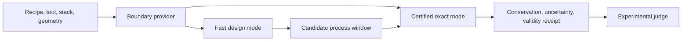

# Competitive differentiation and execution gates for petch

Date: 2026-07-17
Status: scoped strategy only; no implementation is authorized ahead of the active Krüger blind-validation campaign

Related documents:

- [`PHYSICS_FIRST_UNIFIED_ENGINE_2026-07-17.md`](PHYSICS_FIRST_UNIFIED_ENGINE_2026-07-17.md)
- [`PHYSICS_AI_ACCELERATION_ROADMAP_2026-07-17.md`](PHYSICS_AI_ACCELERATION_ROADMAP_2026-07-17.md)
- [`RESONA_PATTERN_TRANSFER_PARTNERSHIP_2026-07-17.md`](RESONA_PATTERN_TRANSFER_PARTNERSHIP_2026-07-17.md)
- [`VIENNAPS_CODEBASE_AUDIT_2026-07-17.md`](VIENNAPS_CODEBASE_AUDIT_2026-07-17.md)
- [`NUMERICS_CALIBRATION_AMR_PLAN_2026-07-17.md`](NUMERICS_CALIBRATION_AMR_PLAN_2026-07-17.md)
- [`VALIDATION_FIRST_SUPERSET_CAMPAIGN_2026-07-17.md`](VALIDATION_FIRST_SUPERSET_CAMPAIGN_2026-07-17.md)

## 1. Decision

Petch should not try to win by accumulating the longest list of physics channels. It should win a
narrower, measurable contest:

> Predict plasma pattern transfer for novel lithography and difficult high-aspect-ratio or
> charging-sensitive structures with better untouched experimental accuracy, fewer and more
> interpretable calibration closures, an explicit uncertainty/error receipt, and a useful fast
> design mode backed by a certified exact mode.

The initial beachhead is plasma etch/deposition feature evolution, not every step in a fab flow.

## 2. What must be matched

Public product pages reveal complementary strengths. They do not disclose enough to rank the
accuracy of closed-source numerics; that requires identical-input partner benchmarks.

### ViennaPS

ViennaPS supplies mature level-set evolution, Monte Carlo ray tracing, multiple materials, custom
models, Python/C++ APIs, and CPU/GPU flux-engine choices. Its fluorocarbon model already includes
etchant, depositing polymer particles, ions, coverages, passivation removal, and net polymer growth.

- https://viennatools.github.io/ViennaPS/
- https://viennatools.github.io/ViennaPS/process/
- https://viennatools.github.io/ViennaPS/models/prebuilt/fluorocarbonEtching.html

Petch must match its geometry robustness, model ergonomics, and routine speed. Deeper physics is not
useful if normal runs do not finish reliably.

### SEMulator3D

Lam describes SEMulator3D as a physics-driven voxel platform that starts from design/process-flow
inputs, builds complex 3-D structures, and supports pathfinding, process windows, defect analysis,
and yield work in minutes to hours.

- https://www.lamresearch.com/product/semulator3d/

Petch should learn its product lesson: engineers buy process decisions, integrated metrics, DOE, and
visualization. Petch should not initially reproduce its full process-integration breadth.

### Sentaurus Topography

Synopsys publicly lists deposition, RIE, ion milling, sputtering, filling/void formation,
reactor-condition effects, RIE lag, bowing, discharge/sheath transport, and wafer energy/angle
distributions inside an integrated TCAD workbench.

- https://www.synopsys.com/manufacturing/tcad/process-simulation/sentaurus-topography.html

Reactor/sheath integration is therefore not a unique claim. Petch must show better accessibility,
feature-kinetic detail, calibration discipline, or held-out accuracy.

### Victory Process

Silvaco publicly lists layout-driven 2-D/3-D processing, multi-material physical etch/deposition,
reflection, redeposition, multi-particle ion-enhanced etch, AMR, multithreading, and open material and
model interfaces. Its plasma-etch description says that reactor-scale simulation is out of scope and
wafer-boundary functions are supplied by the user.

- https://silvaco.com/tcad/victory-process-3d/
- https://silvaco.com/simulation-standard/using-victory-process-for-plasma-etching-simulations/

AMR, reflection, redeposition, and custom rate laws are table stakes. A validated recipe-to-wafer
boundary and experimentally verified material states can differentiate petch.

### HPEM/MCFPM

The Kushner group describes MCFPM as a two- and three-dimensional Monte Carlo feature model driven by
HPEM/PCMCM species fluxes and energy/angle distributions. Its chemistry files support energy and
angular dependence; documented applications include etch, deposition, reflection, microtrenching,
charging, ALE, and reactor/feature studies. The group reports industrial HPEM use.

- https://cpseg.eecs.umich.edu/Projects/MCFPM/MCFPM.htm
- https://cpseg.eecs.umich.edu/

The deepest scientific architecture already exists. Petch's opportunity is to make comparable
physics unified, inspectable, GPU-oriented, reproducible, uncertainty-aware, and usable through one
coherent API.

## 3. The winning combination

| Property | Strength to match | Petch target |
| --- | --- | --- |
| Fast geometry | ViennaPS | Conservative multi-material evolution without losing routine speed |
| Full-flow usability | SEMulator3D | Excellent plasma-transfer ingest, DOE, metrics, movies, and reports |
| Broad physical TCAD | Sentaurus/Victory | Inspectable reaction/state contracts and experimental claim discipline |
| Reactor-feature depth | HPEM/MCFPM | Modular providers, GPU execution, and accessible reproducible workflows |
| Industrial trust | Commercial incumbents | Provenance, conservation, applicability, uncertainty, and held-out receipts |
| Interactive optimization | Emulators/surrogates | Fast proposals whose finalists are certified by exact physics |

Petch therefore needs two speeds sharing one physical schema:



Fast mode may use symmetry, coarse grids, reduced chemistry, response surfaces, or learned operators.
Certified mode uses the declared conservative hard-visibility kinetic operator. Both use the same
material, boundary, geometry, and observable definitions.

## 4. Beachhead: etch-aware pattern transfer

The first superior product slice should answer:

> Given a developed mask/resist geometry and a real etch recipe, what final device geometry will be
> produced, what can fail, and how should the written pattern or recipe be pre-compensated?

This directly serves Resona and advanced patterning. It uses petch's strongest assets:

- energy/angle-resolved kinetic transport;
- finite surface-film and material inventories;
- multi-material mechanism routing;
- reflection and hard visibility;
- charging/field feedback when causally earned;
- conservative geometry/remap ledgers;
- calibration/held-out/refinement contracts.

The first product does not need implantation, diffusion, stress, CMP, oxidation, or full electrical
TCAD. It should export geometry to those established tools.

## 5. What is not differentiation

These are useful but already available elsewhere:

- a level set or voxel geometry;
- generic ray tracing;
- user-defined velocities;
- polymer deposition in principle;
- reflection, redeposition, AMR, or a 3-D viewer in principle;
- a neural surrogate without exact and experimental arbitration;
- fitting enough coefficients to reproduce one SEM.

Claims must rest on untouched prediction, calibration burden, uncertainty, runtime, reliability, and
decision value.

## 6. Experimental benchmark league

Every promoted release should run one immutable league:

| Campaign | Physics stressed | Untouched outcome |
| --- | --- | --- |
| Krüger | Fluorocarbon SiO2, finite mask film, AR transport | Oxygen/power transfer after base calibration |
| Nozawa/Hwang–Giapis | Chlorine poly-Si charging and reflection | Notch versus open area/connectivity |
| de Boer | HAR radical transport and ARDE | Held-out high-AR floor response |
| Jeong | Reactor/sheath boundary response | Etch trend versus measured plasma condition |
| Resona | Resist/hardmask CD transfer | Private held-out profiles and pre-compensation |
| Future SF6/O2 or ALE | New chemistry/cyclic state | Untouched material/recipe transfer |

Each score records calibration observations and parameter count, experimental uncertainty,
grid/time/sample/boundary uncertainty, full-profile and scalar errors, wall time and hardware,
recovery counts, conservation/validity, and identical-input ViennaPS or partner-run commercial
baselines where meaningful and legal.

No condition-specific governing branch is permitted. Revealed misses become development data only
after another independent experiment is reserved.

## 7. Accuracy work after the current verdict

Physics is promoted only after a cheap causal test identifies the limiting channel. Likely order:

1. recipe-to-wafer reactor/sheath boundary provider;
2. declarative conservative reaction-network and material database;
3. Resona-specific resist/hardmask response, including VUV modification only if observed;
4. stable accelerated charging for insulating/HAR structures;
5. volatile-product return, redeposition, and roughness only when residuals demand them;
6. pulse-resolved/ALE state evolution for explicitly cyclic recipes.

A full reactor solver is not automatically first. Measured distributions, reduced/global models,
external HPEM/PIC/fluid providers, or validated surrogates may satisfy the same boundary contract.

## 8. Runtime and reliability program

Certified 3-D kinetics will not always run in seconds. Product speed comes from a multi-fidelity
ladder.

Exact-engine priorities:

- certify and automatically exploit planar, 2-D, periodic, or axisymmetric reductions;
- narrow-band geometry and AMR near interfaces, strong fields, and curvature;
- adaptive physical/profile timesteps and event-local retry;
- reuse trajectories until a measured geometry/field indicator invalidates them;
- batch species/rays/reactions in persistent GPU-resident kernels;
- eliminate repeated host/device and mesh/state reconstruction;
- coarse-to-fine continuation and checkpointed warm starts;
- parallel independent replicates, refinements, and held-out cases;
- performance-regression fixtures beside scientific tests.

Fast-design priorities, only after validation:

- reduced response surfaces for a declared local process window;
- geometry-native learned operators on immutable exact records;
- uncertainty/OOD gating and active exact labeling;
- exact certification of selected optima and window corners;
- a published error/cost frontier.

Initial runtime goals:

| Mode | Target order |
| --- | --- |
| Interactive design query | Seconds |
| Certified 2-D profile | Minutes |
| Certified ordinary 3-D profile | Tens of minutes |
| Extreme HAR/charging/UQ | Hours, unattended |

Production runs use three failure buckets: inline derived recovery, mathematically priced absorption,
and hard halt only for conservation, corruption, unresolved physical topology, or validity failure.
Every long run has checkpoints, heartbeat, bounded automatic resume, and a complete error receipt.

## 9. Product contract

```text
input:
  layout or measured geometry
  material stack
  tool/recipe controls
  requested observables

output:
  final geometry and movie
  CD/depth/taper/mask-budget metrics
  process window and pre-compensation
  uncertainty and sensitivity decomposition
  conservation/recovery/provenance receipt
  validity domain and explicit refusals
```

Required workflow capabilities include GDS/mesh/SEM ingest, versioned reaction/material data, a
reactor-boundary provider interface, one-command reproducibility, automatic calibration/reveal,
DOE/sensitivity/inverse design, and geometry export to device tools.

## 10. Data and partner moat

Equations can be reimplemented. The durable asset is a clean corpus of real pre-etch geometries,
tool/recipe conditions, boundary diagnostics, post-etch profiles with uncertainty, exact simulated
states/fluxes/fields, immutable data splits, and failure/applicability labels.

Resona is an ideal first-partner wedge because it can generate controlled initial geometry families.
The scoped pilot is in
[`RESONA_PATTERN_TRANSFER_PARTNERSHIP_2026-07-17.md`](RESONA_PATTERN_TRANSFER_PARTNERSHIP_2026-07-17.md).
The first claim is only: calibrate one stack/condition, predict at least two untouched final profiles,
and provide a write-CD-to-final-CD rule.

## 11. Arena/AI role

The AI plan remains:

```text
exact engine = teacher + verifier + fallback
learned operator = fast proposal inside demonstrated support
experiment = external judge
```

Neural work follows one exact held-out validation and a stable training-record schema. It does not
precede them. See
[`PHYSICS_AI_ACCELERATION_ROADMAP_2026-07-17.md`](PHYSICS_AI_ACCELERATION_ROADMAP_2026-07-17.md).

## 12. Licensing and clean architecture

The ViennaPS source audit must identify exact licenses and derived-code boundaries before reuse.
Until reviewed:

- run ViennaPS as a separate comparison backend;
- independently implement mathematical/architectural ideas with attribution;
- do not casually mix GPL source into a differently licensed distributable core;
- retain third-party notices and provenance;
- obtain appropriate legal review before distribution.

This is not license avoidance. A service, an open/GPL product, and a separate optional backend have
different implications requiring a deliberate decision.

## 13. Ordered execution

No competitive build starts before the active validation verdict.

1. Complete the fixed-pair 5 nm Krüger endpoint.
2. Apply the one preregistered base-only correction only if earned, then freeze.
3. Run and score all eight blind transfer cases once.
4. Publish the accuracy/runtime/refinement report and profile movie.
5. Complete the read-only ViennaPS source/benchmark catalog.
6. Convert measured gaps—not aspirations—into a backlog.
7. Scope and execute the smallest Resona pilot.
8. Close the reactor/sheath boundary needed by Jeong and recipe-level use.
9. Complete Nozawa and de Boer through the same engine.
10. Optimize exact runtime after physical interfaces freeze.
11. Train the first certified design-mode operator only after exact evidence exists.

## 14. Definition of a competitive win

Petch may claim a material advantage only after:

- at least five blind campaigns span at least three chemistry/material families;
- at least one is an industrial-partner transfer;
- held-out error is inside uncertainty or below the best runnable baseline;
- calibration uses no more parameters than independent evidence identifies;
- the league runs unattended without silent material/charge/energy/probability loss;
- routine design mode is interactive or near-interactive;
- exact mode has a reproducible cost/error envelope;
- one inverse-designed/pre-compensated condition is experimentally confirmed;
- provenance is reviewable and out-of-domain cases refuse.

Until then, the accurate claim is that petch is pursuing a differentiated validated architecture,
not that it has already surpassed ViennaPS or commercial TCAD.
