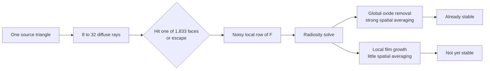

# Diffuse form-factor accuracy audit and production repair

Date: 2026-07-17
Scope: base-boundary Krueger R1.9 checkpoint only; held-out oxygen/power observations remain sealed.

## Decision

The coupled surface-state/radiosity equations and their conservative subcycling are behaving as
intended, and the integrated R17-to-R19 oxide-removal direction is stable. The present single-scramble
form-factor estimate is **not yet accurate enough to drive local profile motion**. SC2 therefore
remains partially open and SC3 live-engine wiring remains held.

This is a **single-scramble ray-level sensitivity result**, not a failed chemistry model. It strongly
implicates the geometric form-factor estimate, but it is not yet a stochastic uncertainty estimate:
that requires independent scrambles. The current estimator asks every one of 1,833 source triangles
to classify a categorical view-factor row using only 8--32 hard rays, all launched from the triangle
centroid. Area-integrated oxide removal averages the observed differences strongly; localized
fluorocarbon deposition, film growth, and one-face extrema do not. Finite sampling, centroid
point-source bias, and hard-hit classification must be separated before assigning fractions to them.

No further endpoint or held-out run is authorized from this evidence. The next work improves and
certifies the common form-factor estimator; it does not add a fitted parameter or change the surface
chemistry.

Implementation status, later 2026-07-17: FF1 is closed and FF2 now has a bounded common-engine
foundation.
`triangle_area` samples the finite source triangle and cosine direction with a nested four-dimensional
scrambled Sobol rule; `legacy_centroid` remains explicitly available for historical replay. An
immutable replicated estimator constructs a conservative mean operator from independent scrambles,
records raw area-reciprocity diagnostics, and reports Student-t uncertainty from independent
radiosity solves. A cell-by-cell float64 periodic tracer distinguishes hard hit, open-top escape, and
wrap-budget refusal. The fast path now has a replay-hardened mode that sends every ambiguous miss and
gas-normal-invalid hit to that authority. Manufactured event parity passes exact and near shared
edges, the production grazing regression, periodic wrapping, and open escape. The first real-checkpoint
audit exposed that the legacy `_apply_bc` path translated a ray slightly at every periodic seam:
at eight rays per face it disagreed with the float64 authority on `991 / 14,664` events and moved
`5.6463%` of the area-weighted row measure. The repaired cellwise path uses exact periodic remapping,
an edge-interior/centroid one-sided launch limit for sub-offset sliver triangles, and a separate
float32 distance-comparison tolerance. It then matched all `14,664` float64 events exactly, including
the target face, termination class, and trajectories with as many as `320` wraps; there were no
wrap exhaustions or solid-facing refusals. That path is now the common estimator's named
`cellwise_certified` production default. Legacy and full-float64 modes remain available for replay
and audit.

The FF3 measurement layer is also implemented without changing triangle physics: triangles are
clipped against fixed SI patch boxes, so patch integrals conserve exact overlap area and remain
invariant under retriangulation. Mixed absolute/relative comparisons prevent a near-zero patch from
creating a fake infinite percentage, while the worst face remains separately reported. Adaptive ray
allocation and a real-checkpoint replicated stopping receipt are not yet implemented.

## Evidence

The diagnostic was amended to preserve all seven exact final surface-state fields, every named
per-face removed/outgoing/unresolved/deposited inventory, and per-face recession/growth. A separate
comparison tool verifies compatible checkpoint, source, direct flux, parameters, operator, and
physical horizon before comparing any values. It applies no post-hoc convergence tolerance.

All three audits use the same fixed 60 s R1.9 checkpoint, seed 241, hard visibility, periodic direct
transport, and `dt_next/16 = 7.7953559 ms` chemistry horizon.

| Quantity | 8 -> 16 rays/face | 16 -> 32 rays/face | Reading |
| --- | ---: | ---: | --- |
| Integrated oxide removal, maximum relative change | 0.2272% | 0.0240% | strongly converging |
| Paired R19-R17 oxide effect, relative change | 0.2225% | 0.0066% | direction robust |
| Any integrated exchange scalar, maximum | 3.2664% | 1.4626% | contracting, not closed |
| Per-face exchange/growth, maximum normalized L1 | 25.20% | 17.90% | contracting, not closed |
| Per-face exchange/growth, maximum relative Linf | 70.08% | 58.27% | not production-ready |
| Final state fields, maximum normalized L1 | 0.1722% | 0.1647% | globally small |
| Final state fields, maximum relative Linf | 8.63% | 17.89% | isolated face remains unstable |

The dominant sensitive quantity is fluorocarbon-film deposition/growth. At 16 -> 32 rays, its
integrated deposition changes by about 1.46%, but its local normalized L1 changes by about 17.5% and
its worst face by about 58%. Oxide removal itself changes by only about 0.024%. Thus the old scalar
audit was directionally correct but insufficient for a moving interface. These nested differences
are sensitivity measurements, not confidence intervals.

Receipts:

- `results/krueger_2024_r19_response_check/frozen_radiosity_chemistry_rays8_horizon_1of16_state/audit.json`
  SHA-256 `7c325cffd0faeb4a23d769b4cd08e5910f77a2684041f89aa0a456cee72bfe01`;
- `results/krueger_2024_r19_response_check/frozen_radiosity_chemistry_rays16_horizon_1of16_state/audit.json`
  SHA-256 `c6b9f627b976b12677afff6bd2295df32e3f7b753f88df05a491027a8f924c14`;
- `results/krueger_2024_r19_response_check/frozen_radiosity_chemistry_rays32_horizon_1of16_state/audit.json`
  SHA-256 `5d234b2917c86bd16813e3f95026744e6623f63ae0c68630f12526b7ec75121c`;
- cross-ray receipts SHA-256 `4aaaa708a60601ae42ca5c7acbab4d9609ea5fa4478554636c91b129dcc5baa5`
  and `0afd97074211df23c9cfd04cca4539c5aebb44c1e178d5839f6fe39c7161846d`.

The 8/16/32 runs took 158.8/117.9/183.5 s on local CPU and all stopped inside their declared 240 s
budgets. All coupling-step, material-ledger, radiosity-balance, displacement, and tight/nominal gates
passed independently at every ray level.

## Why the existing estimator has this behavior

The 8/16/32 evidence was produced by the historical estimator: one scrambled two-dimensional Sobol
hemisphere rule, a deterministic per-face Cranley shift, and centroid launch. The levels are nested,
so the 8-point set is contained in 16, then 32. That is good for paired refinement. It is not an
uncertainty estimate: one scramble supplies one realization. A finite-triangle diffuse form factor is
an area-and-angle integral, so the new production-target mode samples source position as well as
hemisphere direction. Centroid launch is now retained only as a named point-patch replay operator.

Each ray contributes a discontinuous hit/escape category. Scrambled nets remain unbiased and can
outperform ordinary Monte Carlo for square-integrable integrands, but independent scramblings are what
supply an empirical variance/error estimate; one deterministic replay cannot do so. See Owen,
[Scrambling Sobol' and Niederreiter--Xing Points](https://doi.org/10.1006/jcom.1998.0487).

The adjacent radiosity literature supplies the scaling idea: adaptively refine transport interactions
against an explicit error criterion instead of assigning every polygon the same enormous budget.
Hanrahan, Salzman, and Aupperle's
[hierarchical radiosity algorithm](https://graphics.stanford.edu/papers/rad/) constructs a multilevel
form-factor representation and refines the blocks that exceed the requested accuracy. We do not need
to copy a graphics implementation, but the error-controlled hierarchy is the right numerical pattern.

This also matches feature-scale etch practice. Hoang, Hsu, and Chang report that their surface
representation was designed specifically to remove artificial flux fluctuations while retaining
profile observables such as bowing and microtrenching
([JVST B 26, 1911](https://doi.org/10.1116/1.2998756)). The product requirement is therefore not
"more random rays everywhere"; it is a conservative surface transport estimate whose uncertainty is
smaller than the physical feature being predicted.

## Stable task: production form-factor authority

The stable task is to make diffuse neutral transport a conservative, uncertainty-scored common-engine
operator. The following subtasks may adapt as their evidence lands.

### FF0 — Receipt completeness (complete)

- Persist exact final state, per-face inventories, and recession/growth.
- Compare identical operator epochs across nested ray levels.
- Always report integrated, fixed-physical-patch, and worst-face diagnostics separately.

### FF1 — Correctness and geometry contract (complete)

Before changing sampling:

1. add analytic/open-plane, parallel-plate/enclosure, occlusion-edge, periodic-seam, and extreme-area
   manufactured cases;
2. report row closure and area-reciprocity residual `|A_i F_ij - A_j F_ji|` without silently projecting
   it away; row closure alone cannot certify visibility because a misclassified ray still lands in
   exactly one conservative hit/escape bin;
3. certify CPU/GPU hard-hit parity and test the float32 shared-edge case against the existing float64
   exact replay machinery;
4. replace centroid launch with a nested four-dimensional Sobol rule over uniform source-triangle area
   and cosine-hemisphere direction. Retain centroid launch only as a named legacy comparison. Require
   convergence to analytic enclosure truth and to mesh-refined area-sampled results.

Failure means repair visibility/geometry first. It does not authorize more rays or chemistry tuning.

Manufactured status: finite-area sampling removes a greater-than-10% close-receiver centroid bias and
agrees with a mesh-refined reference within 1%; nested samples replay exactly. Float64 and Warp agree
on the bounded adversarial suite. Replay hardening closes the escape-versus-wrap-exhaustion ambiguity.
The real-checkpoint eight-ray audit then passed exact full-event parity on all `14,664` rays. The
authoritative receipt is
`results/krueger_2024_r19_response_check/form_factor_visibility_parity/audit.json`; its promoted
cellwise and reference event SHA-256 is
`6e357c6793dbf0d3e0300d785afb127101198c5846512caed48af0bb808054ad`, and the complete audit-file
SHA-256 is `3c233b3c8861ece1c82dcf1edc4712ed8109d6cc1ec50bc9367371e78deb8d56`.

### FF2 — Independent replicated scrambled-QMC estimate (foundation implemented)

Add a reusable immutable ensemble object, separate from the chemistry:

- at least four independently scrambled Sobol replicates;
- nested `N -> 2N` within every replicate;
- an exactly row-closing mean form-factor operator;
- replicate uncertainty for incident/reacted flux and downstream surface rates;
- exact seeds, levels, mesh/operator fingerprints, and call counts in provenance.

The physical operator is the radiosity solve on the mean form-factor estimate. Replicate solves score
its uncertainty; chemistry endpoints are not averaged to disguise nonlinear bias.

Current status: the immutable ensemble, conservative mean, raw reciprocity report, exact construction
identity, and downstream radiosity intervals pass manufactured tests. The first checkpoint coverage
audit must use at least eight independent scrambles; four is only the enforced API minimum.

### FF3 — Prospective stop rule and adaptive allocation (patch core implemented; controller integration open)

The new stop rule is declared before another Krueger diagnostic:

- integrated oxide and mask rates: nested-level change and 95% replicate interval each <= 1%;
- at no fewer than two fixed physical patch scales: surface-state and recession/growth uncertainty
  <= 5%; at least one patch scale must not exceed the profile feature being claimed;
- worst-face values remain reported forever but are not allowed to define a physical claim below the
  mesh resolution;
- the paired R19-R17 direction must agree across levels and its uncertainty must be reported;
- exact row closure, radiosity balance, and material ledgers remain non-negotiable.

Start with a small common ray floor, then add nested rays only to source patches whose contribution to
the downstream error budget exceeds the gate. A global ray increase is a diagnostic fallback, not the
production controller.

Patch status: exact triangle/box overlap integration, stable material/orientation/Cartesian keys,
two-scale enforcement, area conservation, subdivision invariance, near-zero mixed norms, and separate
worst-face reporting pass. The support repair now distinguishes an actual physical patch from an
arbitrarily small clipped surface sliver: every patch remains in the fixed-footprint integrated gate,
while a local mean is gated only above a predeclared dominant-axis projected-support fraction. The
formal threshold is `0.10`, is serialized rather than inferred from a score, and must be accompanied
by sensitivity receipts. An all-ineligible comparison refuses. Periodic-domain normalization counts
the represented 20 nm y-cell once when a 40 nm Cartesian patch is requested. Controller integration
and one current-operator checkpoint receipt remain open.

### FF4 — Variance reduction only if FF3 is inefficient

Ranked branches:

1. measure then enforce reciprocity through a nonnegative conservative projection, validated against
   analytic enclosure cases;
2. hierarchical physical surface patches with conservative restriction/prolongation and refinement
   near visibility/sticking gradients;
3. deterministic hemicube/ballistic-integral integration as an independent audit backend.

No spatial smoothing may be introduced merely to make a plot look stable. Any patch hierarchy ends in
the same triangle-level conservative operator under refinement.

### First real FF2/FF3 receipt — bounded precision hold

The sealed-base Stage-A audit completed in `295.408 s`, inside its process-enforced `300 s` ceiling:

- artifact: `results/krueger_2024_r19_response_check/replicated_form_factor_closure/audit.json`;
  SHA-256 `4e28066dcd0257feffac8983a462045b9fb5686eeaa762b3dce096422b3732b0`;
- eight fixed independent scrambles at nested `8 -> 16` rays/face;
- exact row closure at both levels and exact nested sample extension;
- one/six ambiguous events at 8/16 rays were replayed in float64 across the replicate sets; every
  replay completed, six total events recovered a float32 shared-edge hit, and the longest genuine
  open-top escape used `1,077` periodic cells;
- radiosity balance, material ledgers, physical patch-scale eligibility, and the paired R19-R17
  direction all pass. At 16 rays, R19 minus R17 SiO2 recession is
  `-5.35367e-14 m`, with paired 95% half-width `1.22607e-17 m`;
- the integrated SiO2 recession and mask recession/growth observables pass their prospective
  uncertainty gates at both levels;
- local 20/40 nm incident/reacted flux and fluorocarbon-film quantities do not pass: the worst
  level-16 patch confidence receipt is about `48.5x` the declared mixed tolerance;
- the `dt_next/16 = 7.795 ms` diagnostic horizon predicts `0.729--0.733 dx` maximum motion at level
  16, so it is not a valid frozen-geometry horizon under the existing `0.05 dx` contract.

Therefore Stage B remains held. The evidence selects two narrow repairs, not a global ray sweep:

1. derive a common shorter frozen horizon with margin from the measured worst displacement, then
   freeze it before rescoring; and
2. construct an adjoint/row-contribution allocator from the persisted direct and form-factor
   artifacts, rank the source faces responsible for the failed physical patches, and refine only
   their nested Sobol rows. A global 32-ray run remains unauthorized.

### Allocation result and estimator decision

The persisted Stage-A artifacts were sufficient to close the exact signed row-contribution identity
to `2.96e-15` without tracing another ray. The initial all-patch ranking looked concentrated: 90% of
its score occupied `234/1833` source faces (`12.77%`). That conclusion was driven partly by clipped
patches with almost no physical support. Restricting the diagnosis to patches with at least 10%
dominant-axis projected support makes the error diffuse: 90% requires `758/1833` faces (`41.35%`).
The predeclared 25% cap selects 458 faces but captures only `78.99%`, so the allocator returns
`diffuse_source_error_blocker`. It does not authorize a selected-row checkpoint run.

This negative gate also exposes the simpler cost model. Appending indices `[16,32)` to all 1,833
faces and eight scrambles costs only `234,624` additional ray events. Existing 8/16 form-factor
tracing takes seconds, whereas direct transport took `104.390 s` and the entire response audit took
`295.408 s`. Selective rows would complicate sample-level identity, reciprocal precision, and
uncertainty while saving only part of the cheapest component. The next real estimator rung is
therefore a **uniform paired 16->32 extension**, after patch-controller integration and a directly
verified `dt_next/1024` short horizon. This is an explicit evidence-driven amendment to the earlier
global-32 hold, not automatic escalation; Stage B and all profile work remain held.

The literature supports one later variance-reduction candidate but not blind smoothing. In exchange
area coordinates `H_ij = A_i F_ij`, internal reciprocity `H_ij = H_ji` and row closure including an
escape category are exact linear identities. A fixed affine projection onto those identities is a
linear control variate and remains unbiased when its weights are fixed independently. A nonnegative
projection or constrained maximum-likelihood adjustment is nonlinear and can be finite-sample
biased; the common multinomial likelihood also does not describe dependent scrambled-Sobol points.
Consequently no projected operator enters this campaign until it passes an analytic open-periodic
groove test against untouched raw RQMC. Relevant primary sources are Owen's
[scrambled-net variance analysis](https://doi.org/10.1137/S0036142994277468), Taylor and Luck's
[NASA view-factor constraint study](https://ntrs.nasa.gov/citations/19950020932), Daun, Morton, and
Howell's [constrained exchange-factor estimator](https://doi.org/10.1115/1.2035111), and Cumber's
[hybrid QMC/view-factor comparison](https://doi.org/10.1016/j.ijheatmasstransfer.2022.122698).

### FF5 — Re-enter SC2, then SC3

Rerun only the shortest frozen Krueger horizon through the replicated/adaptive estimator. If FF3 passes,
wire the already-tested `surface_radiosity_coupling_3d` module into the opt-in feature step and purchase
the short `0.5 s` 10/5 nm/AMR truth test. If FF3 cannot close inside the declared budget, hold live
wiring and promote FF4; do not run a 60 s endpoint.

## What is and is not earned

Earned:

- state-dependent radiosity must be co-integrated with surface chemistry;
- the conservative coupled integrator passes manufactured and checkpoint step-refinement gates;
- R19 produces about 1.45% less oxide removal than R17 on the fixed late checkpoint, and that paired
  direction is stable through 32 rays/face;
- the remaining old-operator discrepancy is localized form-factor ray-level sensitivity, especially
  fluorocarbon deposition;
- finite-area source sampling, independent replicated uncertainty, raw reciprocity diagnostics,
  a certified exact-periodic production tracer, a full float64 event authority, and
  retriangulation-invariant physical patch scoring now exist and pass bounded tests;
- full-event fast/float64 parity is exact on the `1,833`-face real Krueger checkpoint at eight rays
  per face, and the shared operator promotion retains a clean `820 passed, 1 skipped` regression.

Not earned:

- locally converged film growth or profile velocity;
- a production ray count;
- replicated real-checkpoint FF3 closure;
- live common-engine coupling;
- a new Krueger endpoint, calibration freeze, or held-out validation claim.
