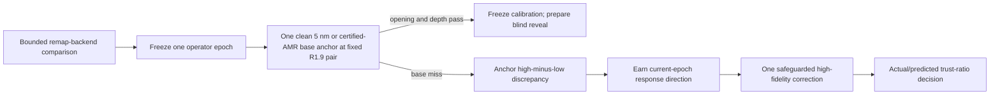

# Krüger 2024 multi-fidelity calibration readiness

Date: 2026-07-17

Status: controller implemented; real campaign correctly blocked before another parameter proposal

## Result

The engine now has a reusable affine multi-fidelity trust-region primitive, but the current Krüger
evidence does **not** authorize another parameter pair.

That is a useful result. The R1.9 run already demonstrated what happens when a cheap response model
is allowed to steer after its operator changes: the model predicted improvement, while the actual
10 nm merit worsened and produced `rho=-1.3955`. Reusing that Jacobian for a nominal "fine-grid
correction" would repeat the failed assumption under a new name.

The new controller follows standard model-management structure: the cheap model proposes locally,
the expensive model remains in the loop, and the trust radius changes according to the ratio of
actual to predicted high-fidelity improvement. This is the central role of trust-region
multi-fidelity management in the literature, not merely a more efficient parameter sweep
([Peherstorfer, Willcox, and Gunzburger](https://epubs.siam.org/doi/10.1137/16M1082469);
[Alexandrov et al., NASA](https://ntrs.nasa.gov/citations/20000097390)). The implementation requires
low/high value consistency at the current center and, by default, enough paired directions to
identify the discrepancy gradient. That guards the high-fidelity destination when a low-fidelity
optimum or response direction is wrong; approximation improvement alone does not guarantee
high-fidelity improvement
([NASA surrogate-management report](https://ntrs.nasa.gov/citations/20040100728)).

## What was implemented

`src/petch/multifidelity_calibration.py` provides benchmark-independent functions for:

- declared-scale calibration merit;
- rank- and condition-checked weighted affine response fitting;
- a high-minus-low discrepancy model anchored exactly at the current parameter point;
- explicit classification of center-only versus first-order-identified discrepancy evidence;
- bounded, physical-box trust-region proposals;
- actual/predicted high-fidelity trial scoring with reject/shrink, accept/hold, and accept/grow
  decisions.

It operates on small parameter/observable arrays and is not a second plasma or chemistry engine.
No benchmark values are embedded in it.

`scripts/krueger_2024_multifidelity_readiness.py` applies the evidence rules to Krüger without
opening the oxygen/power transfer table. It verifies hashes linking the pre-run R1.9 manifest, the
completed run, the rejected response evaluation, the paired 10/5 preflight, the CUDA summary, and
the two-row base calibration table.

## Why the real campaign is blocked

The machine receipt reports five concrete blockers.

### 1. The production remap backend is not frozen

The paired 10/5 and CUDA preflights inherited `legacy_knn`. Indexed, overlap, and common-refinement
operators now exist, but their Krüger same-state answer/cost comparison has not yet been run. A
long authority endpoint cannot silently choose a different state-transfer operator.

### 2. R1.9 belongs to a prior operator epoch

The R1.9 manifest hashes `feature_step_3d.py` as
`61dbef70...`; the current file hashes as `ca9c4bf0...`, and the current epoch additionally includes
the separately checksummed shared surface/transport/mechanism modules. The old response remains
historical development evidence, not a current derivative.

### 3. There is no current-epoch high-fidelity endpoint anchor

No clean uniform-5-nm or certified-AMR 60 s endpoint exists under the current operator. Therefore
the high-minus-low discrepancy at the proposed center is unknown.

### 4. The 0.5 s pair is not an endpoint discrepancy

The initial 10/5 pair is informative:

- depth-rate difference: `0.073%`;
- opening-rate difference: `1.433%`;
- maximum-width-rate difference: `71.235%`.

It sizes shallow numerical error and identifies a local-shape problem. It cannot be multiplied by
60 s or substituted for an endpoint correction because the completed R17/R19 trajectories already
showed access, polymer state, mask geometry, and oxide removal feeding back nonlinearly over time.

### 5. A current first-order response is not identified

For two parameters, an unconstrained affine low-fidelity response needs at least three spanning
current-epoch endpoint observations. A fully identified affine discrepancy correction likewise needs
the center plus two independent paired directions. The current campaign has zero of each under the
selected future operator. The generic controller reports this rather than inventing derivatives.

## Exact next sequence



The fixed anchor parameters are not a new fit:

```text
effective_mask_crosslinked_growth_fraction = 0.9004722559883319
oxide_etch_yield_scale                      = 0.5586489665864749
```

They are the last checksum-bound R1.9 location. If the clean fine/AMR anchor already meets base
tolerances, calibration freezes immediately and no correction is needed. If it misses, the anchor
creates a value-consistent discrepancy receipt; a current-epoch physical or empirical response
direction must then be earned before the one permitted fine correction.

## Evidence and verification

Machine receipt:
`results/krueger_2024_multifidelity_readiness/audit.json`.

Focused multi-fidelity, readiness, calibration, seal, and R1.9 evaluation tests pass: `31 passed`.
No simulation, GPU instance, parameter proposal, held-out read, or reveal was performed.
