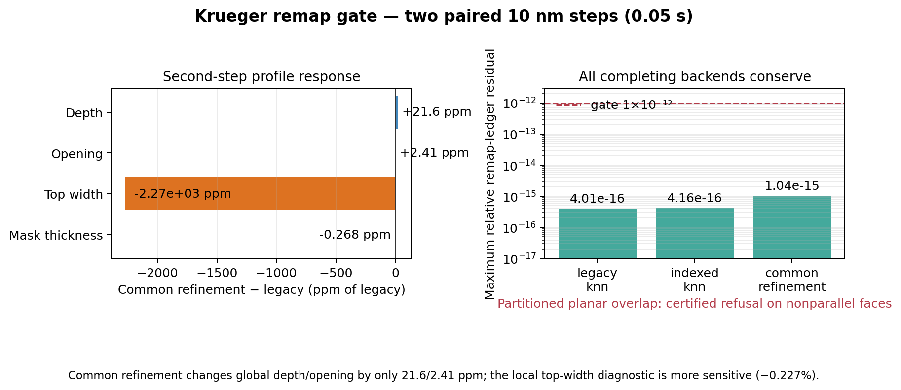

# Krueger 2024 surface-state remap backend audit

Date: 2026-07-17

Branch: `codex/validation-first-multiphysics`

Scientific scope: bounded base-boundary operator selection; no held-out Krueger outcomes read.

## Why this operator matters

The profile is represented by a level set, while chemistry state is attached to the triangulated
surface extracted from that level set. After every etch step, marching cubes produces a new set of
triangles. Polymer coverage, activated fractions, and removed-material inventories must therefore
be transferred from the old physical surface to the new one. The transfer changes no geometry in
the step that invokes it, but it changes the chemistry seen by the next step.

This audit asks a narrow question: which implemented transfer is conservative, geometrically
certifiable on the real Krueger mesh, and suitable for a clean current-operator calibration anchor?
It is not a calibration and it does not inspect any transfer condition.

## Precommitted bounded protocol

- Same analytic `130 × 20 nm` periodic Krueger cell at `10 nm` spacing.
- Same fixed R1.9 parameter location, base boundary, random seed epochs, and exact operator.
- Four backends: legacy centroid KNN, indexed surface KNN, partitioned planar overlap, and tangent
  common refinement.
- Zero-time initialization followed by exactly two `0.025 s` steps per backend.
- Step one must produce identical geometry across every completing backend; only step two can expose
  a downstream state-transfer consequence.
- Maximum physical horizon `0.05 s`; process timeout `300 s`; each backend isolated in its own
  worker; no hidden retry or topology continuation.

## 10 nm result

| Backend | Status | Max remap residual | Wall time (s) | Depth after step 2 (nm) | Opening after step 2 (nm) | Top width after step 2 (nm) |
| --- | --- | ---: | ---: | ---: | ---: | ---: |
| legacy centroid KNN | complete | `4.01e-16` | 82.08 | 0.6832803 | 89.4668343 | 86.7568610 |
| indexed surface KNN | complete | `4.16e-16` | 82.23 | 0.6832803 | 89.4668343 | 86.7568610 |
| partitioned planar overlap | certified refusal | — | 56.11 | — | — | — |
| tangent common refinement | complete | `1.04e-15` | 82.10 | 0.6832950 | 89.4670499 | 86.5598767 |

All completing backends have a zero material-exchange ledger residual and no topology event. Their
initial geometry hashes, initialized state hashes, and first-step geometry hashes are identical.
The partitioned planar method refused a nearby nonparallel face pair rather than projecting a curved
surface onto an invalid single-plane overlap.

The common-refinement transfer records physical removed and newly exposed surface area and closes
every conservative field at roundoff. Relative to legacy KNN after one downstream step:

- depth changes by `+1.4729e-5 nm` (`+21.6 ppm`);
- opening changes by `+2.1564e-4 nm` (`+2.41 ppm`);
- remaining mask thickness changes by `-2.2756e-4 nm` (`-0.268 ppm`);
- the local top-width diagnostic changes by `-0.19698 nm` (`-0.227%`).

The first three quantities show that the global early response is stable. The larger local-width
sensitivity is not a failure: it is precisely why a physical, conservative state-transfer operator
must be selected before a long nonlinear endpoint. KNN and common refinement conserve different
models—global redistribution versus removed/newly-exposed physical surface ownership—even when
their short global observables nearly agree.

## Decision

The `10 nm` gate promotes `common_refinement` as the production candidate. It does not yet authorize
a long endpoint. The earned next action is one bounded `5 nm` paired confirmation against indexed
KNN. If the common-refinement worker closes its ledgers without a geometric refusal and the paired
first-step geometry remains identical, freeze this backend for the clean current-epoch base anchor.

Machine receipt: `results/krueger_2024_remap_backend_audit/audit.json`.
