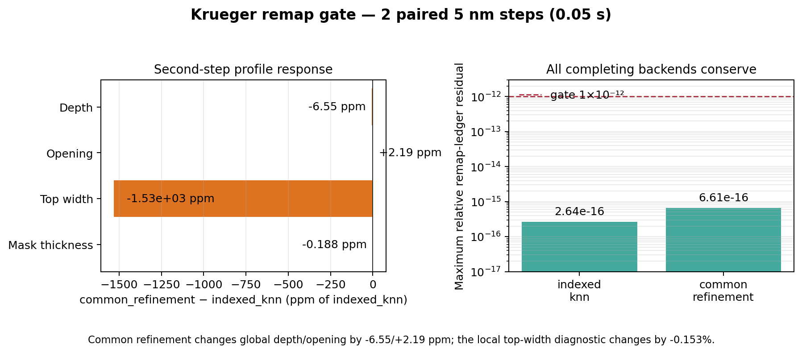

# Krüger 2024 conservative remap selection

Date: 2026-07-17  
Scope: base boundary only; no held-out oxygen/power outcomes were read.  
Decision: select `common_refinement` for the clean 5 nm anchor and every sealed transfer run.

## Why this gate existed

The chemistry state lives on a triangulated material surface. Marching the level set rebuilds that
surface, so polymer coverage and conserved inventories must be transferred to a new set of
triangles. The transfer is part of the evolution operator: an inaccurate remap can change the next
etch step even when the current geometry is unchanged. The authoritative run therefore cannot use
an implicit backend default.

## Paired experiment

Both `indexed_knn` and `common_refinement` began from the same analytic 5 nm trench, surface state,
seed, CUDA transport device, and two fixed 0.025 s steps. The first profile-step geometry is
byte-identical; only the remapped state can affect step two. Each worker was hard-limited to 600 s.

| Gate | Indexed nearest surface | Common refinement |
| --- | ---: | ---: |
| Completed paired steps | 2 | 2 |
| Material-ledger residual | 0.0 | 0.0 |
| Maximum relative remap residual | 2.64e-16 | 6.61e-16 |
| Topology event | none | none |
| Worker wall time | 21.18 s | 14.56 s |

At the second step, common minus indexed was:

- etch depth: -0.00000448 nm (-6.55 ppm);
- mask opening: +0.000196 nm (+2.19 ppm);
- remaining mask thickness: -0.000160 nm (-0.188 ppm);
- maximum feature width: -0.13485 nm (-0.153%, or 2.70% of one 5 nm cell).

The global calibration observables are effectively unchanged, while the local width diagnostic
exposes the expected sub-cell sensitivity to how the surface inventory is reconstructed. Common
refinement is retained because it transfers by conservative geometric overlap rather than nearest
samples, closes the same ledgers, and was 31.3% faster in this paired run.

## CPU/GPU interpretation

The same pair on the local CPU hit the 600 s limit for both workers before producing a step. This
does not mean remapping itself is a CUDA kernel. The audit surrounds the remap with the full
transport/profile operator; CUDA removes the dominant particle-transport cost, while the rented
host's 32 effective CPU cores and fast NVMe execute geometric transfer. The production architecture
therefore remains hybrid: GPU transport plus a CPU conservative remapper.

## Bound operator contract

Commit `12aee41` makes the selected remap backend explicit in the pilot configuration, config hash,
checkpoint-resume compatibility, calibration freeze, and blind transfer supervisor. A trajectory
cannot change remap backend on resume. The freeze gate accepts only the selected non-legacy operator
shared by the 10 nm proposal and 5 nm authority endpoints.

Raw evidence and environment provenance are in
`results/krueger_2024_remap_backend_audit_5nm_gpu/`. The exact committed source archive checksum is
`21889b138f333c618f6fceb189d3618a84c4425b03f2630e9eed41879f30a795`.

## What this earns—and what it does not

This closes surface-remap operator selection. It does not validate Krüger held-out profiles and it
does not authorize a new chemistry fit. The next earned experiment is one clean 5 nm base endpoint
at the already-fixed R1.9 parameter pair, using `common_refinement`. Only after that anchor passes or
receives the protocol's single base-only grid correction may the oxygen/power outcomes be revealed.
