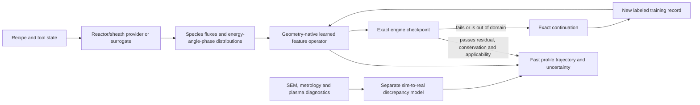

# Physics-AI acceleration roadmap for petch

Competitive strategy: [`COMPETITIVE_DIFFERENTIATION_ROADMAP_2026-07-17.md`](COMPETITIVE_DIFFERENTIATION_ROADMAP_2026-07-17.md)
Resona partner scope: [`RESONA_PATTERN_TRANSFER_PARTNERSHIP_2026-07-17.md`](RESONA_PATTERN_TRANSFER_PARTNERSHIP_2026-07-17.md)

Date: 2026-07-17
Status: architectural roadmap; no learned model is part of the validated engine yet

This document records how learned operators can make petch fast without replacing its evidence
contract. It complements `PHYSICS_FIRST_UNIFIED_ENGINE_2026-07-17.md`, which remains authoritative
for governing physics, validation claims, and numerical invariants.

## 1. Decision

petch should become a hybrid physics/learning system. It should not begin by training a monolithic
"etch foundation model" on the current campaign outputs.

The immediate actions are:

1. preserve solver states as provenance-complete training records;
2. profile and accelerate the exact engine so it can become a useful data factory;
3. close at least one strict held-out experimental validation;
4. train a bounded, geometry-native one-step feature operator;
5. deploy the learned operator first as a proposal, warm start, or preconditioner whose result is
   checked by the exact engine;
6. add an independently trained reactor/sheath boundary surrogate;
7. scale toward a multi-process foundation operator only after the data ontology, solver, and
   sim-to-real correction path are stable.

The exact engine remains the teacher, verifier, fallback, and generator of controlled counterfactuals.

## 2. Why the Arena Physica analogy is useful but incomplete

Arena Physica describes a data factory containing expert templates, procedural variants, broad random
geometries, slow-solver labels, and measured hardware data. Its initial RF release reports three
million simulated designs, a forward model that predicts S-parameters in milliseconds, and an inverse
model that proposes geometries. It also reports that full-field labels on a small subset improved
generalization.

That is the right strategic pattern for petch:

```text
trusted solver + diverse procedural geometries + expert cases + physical measurements
                                  |
                                  v
                    forward field/profile model
                                  +
                    inverse recipe/design model
```

The reported Arena speedups cannot be transferred numerically to etching. Its public comparison is a
static electromagnetic geometry-to-response map. Feature etching is history-dependent and may include
moving topology, material-local surface memory, stochastic transport, chemistry, neutral re-emission,
charging, and a reactor boundary. Its learned model must therefore carry more state and survive long
rollouts.

Arena sources:

- https://www.arenaphysica.com/publications/rf-studio
- https://www.arenaphysica.com/thesis

## 3. The hybrid product architecture



The production system should expose at least two modes:

- **Design mode:** learned rollout for rapid recipe search, uncertainty analysis, and ranking.
- **Certified mode:** the learned model proposes states or large steps; the exact operator audits and
  corrects them at declared intervals and at the final state.

The learned result is never silently substituted for the exact result in a validation claim.

## 4. Data contract

Every accepted exact-engine step should optionally emit one immutable training record containing:

### Inputs

- signed-distance geometry and material-local level sets;
- surface mesh or point cloud, normals, curvature, material identity, and mesh fingerprint;
- material-local coverages, polymer/film state, temperature, and other intensive state;
- surface charge, conductor state, potential, and prior fields when enabled;
- dimensional species fluxes and normalized energy-angle-phase-position distributions;
- tool/provider provenance, waveform phase, and physical time;
- numerical resolution, estimator mode, random epoch, source revision, and configuration hashes.

### Targets

- species-resolved face-arrival rates and energy/angular moments;
- neutral radiosity/re-emission fields;
- electric potential and field when charging is enabled;
- reaction-channel rates and material/product ledgers;
- surface-state increment and signed normal velocity;
- accepted next geometry and state;
- target observables such as depth, opening, bow, notch, microtrench, and twist statistics.

### Trust metadata

- conservation residuals and bounded-closure inventories;
- refinement level and estimated numerical uncertainty;
- applicability/validity result and refusal reason, if any;
- whether the state comes from development, calibration, held-out prediction, or experiment;
- checksum links to raw artifacts.

Failed or invalid states may be useful negative examples, but they are never labeled as physical ground
truth.

## 5. Split discipline

Consecutive timesteps from one trajectory are highly correlated. Randomly assigning them to training
and test sets would leak nearly identical geometry and state into both sets.

All evaluation splits must be grouped by entire physical campaigns:

- unseen recipe;
- unseen geometry family or aspect-ratio band;
- unseen material/chemistry combination;
- unseen tool/provider condition;
- unseen random realization for stochastic claims.

The strongest generalization test holds out complete geometry templates or process families. Synthetic
holdout performance measures emulation of the declared engine. Experimental holdout performance
measures predictive physical value. They are separate claims.

## 6. First learned operator

The first model should approximate one authoritative feature update:

\[
(\Gamma, z, Q, f_s) \longmapsto
(J_s, E, \Delta z, v_n, \mathcal{U}),
\]

where \(\Gamma\) is geometry, \(z\) is material surface state, \(Q\) is charge, \(f_s\) is the
wafer-boundary distribution, \(J_s\) is the delivered face flux, \(E\) is the optional electric
field, \(v_n\) is normal velocity, and \(\mathcal{U}\) is calibrated uncertainty.

A geometry-informed neural operator, surface graph operator, or a multiresolution combination is a
better starting point than a fixed-image network. Candidate precedents include Geo-FNO and
MeshGraphNets:

- https://www.jmlr.org/papers/v24/23-0064.html
- https://arxiv.org/abs/2010.03409

Architecture sketch:

```text
surface/SDF geometry encoder ----\
material-state encoder -----------+--> nonlocal geometry operator --> field heads
boundary-distribution encoder ----+                               \--> state/velocity heads
tool/material adapters -----------/                                \-> uncertainty head
```

The output should include physical fields, not only final depth and opening. Field supervision exposes
causal structure and makes it harder for the model to learn a benchmark-specific scalar shortcut.

## 7. How the exact engine stays in the loop

Safe initial uses, in increasing order of authority:

1. predict a warm start for Poisson, charging, or another iterative solve;
2. predict a coarse-to-fine correction;
3. propose a larger surface/profile step that the exact operator accepts or rejects;
4. replace several exact feature steps between exact checkpoints;
5. provide a fast design-only endpoint surrogate;
6. after extensive evidence, provide a certified hybrid trajectory with a priced error envelope.

A neural prediction must fall back to exact physics when:

- input novelty or ensemble uncertainty exceeds its threshold;
- any mass, charge, energy, probability, or material ledger fails;
- the exact residual exceeds tolerance;
- a topology event lies outside the training contract;
- the request leaves its declared chemistry, geometry, energy, or tool domain.

Neural warm-start work is relevant because it preserves the numerical solver as final authority:

- https://www.sciencedirect.com/science/article/pii/S0021999125001548

## 8. Electric-field modeling

Potential and electric field should be supervised outputs and useful latent variables. A neural model
should not initially replace the Poisson solve:

- Poisson has strong mathematical structure and an inexpensive exact residual;
- in many petch workloads the larger cost is repeated transport, radiosity, moving geometry, or
  stochastic current estimation;
- a learned field is valuable as an initializer or preconditioner even when an exact solve follows;
- charging claims still require the original boundary conditions, charge ledger, and unused-sample
  kinetic audit.

For etching, "field learning" should include species flux fields, angular/energy moments, material
state, charge/current response, and velocity—not electric field alone.

## 9. Reactor and sheath surrogate

A separate upstream model should learn

\[
(\text{recipe},\ \text{tool state},\ \text{waveform})
\longmapsto
(\Gamma_s,\ \mathrm{IEDF}_s,\ \mathrm{IADF}_s,\ \text{phase distributions}).
\]

This is the bridge from recipe to the existing `PlasmaBoundaryState` contract. It directly addresses
the upstream boundary ambiguity exposed by the Jeong campaign. A recent plasma study demonstrated a
learned surrogate for multi-species thermal/RF sheath ion energy-angle distributions generated by a
PIC model:

- https://www.cambridge.org/core/journals/journal-of-plasma-physics/article/machine-learning-surrogates-for-ion-energyangle-distributions-in-thermal-and-rf-plasma-sheaths/5DD1646E14077069C0BF68190928C01B

The surrogate should first emulate a declared PIC/fluid/hybrid provider. Sparse diagnostics then train
a separate discrepancy or adaptation layer. Solver emulation and sim-to-real correction should not be
collapsed into one opaque network.

## 10. Multi-fidelity data factory

Use much more inexpensive, verified low/production-resolution data and selectively acquire expensive
fine-grid labels:

- production-grid trajectories across broad process and geometry space;
- one-step fine-grid labels at active-learning points;
- full fine-grid endpoints only where the error model demands them;
- analytic/manufactured cases for invariance and conservation;
- deliberately unusual but physically valid geometries to reduce template overfitting;
- experiments and diagnostics reserved for sim-to-real calibration and blind validation.

Physics-enhanced deep surrogates have shown that combining an explainable low-fidelity model with a
learned correction can substantially reduce high-fidelity data requirements:

- https://www.nature.com/articles/s42256-023-00761-y

Active learning should request an exact label where uncertainty, novelty, predicted closure error, or
observable sensitivity is largest. The data factory should not uniformly spend compute on easy states.

## 11. Numerical acceleration still comes first

The exact engine must also become faster. It is required for labels, arbitration, new-physics
development, out-of-domain cases, and customer trust.

Near-term numerical targets are:

- component-level wall-clock profiling;
- narrow-band or AMR geometry/state evolution;
- GPU-resident level-set, material-routing, and surface-state operations;
- incremental geometry/visibility updates;
- transport and radiosity reuse with certified change indicators;
- multilevel sample allocation and high-accuracy checkpoint audits;
- parallel cases for campaigns and uncertainty.

Only the measured dominant costs should be optimized. A learned Poisson solver is unhelpful if moving
geometry consumes most of the wall clock.

## 12. Promotion gates for the first model

A learned operator is promoted only if it passes all of the following on grouped unseen cases:

- material, mass, charge, energy, and probability conservation within the exact-engine error budget;
- symmetry/equivariance and zero-input manufactured gates;
- field and observable error within a declared production tolerance;
- stable multi-step rollout without hidden drift;
- calibrated uncertainty that expands on out-of-domain inputs;
- automatic fallback tested on novel geometry and topology events;
- measured end-to-end speedup including data movement and exact checkpoints;
- an experimental held-out result no worse than the exact engine within combined uncertainty.

The first target should be a meaningful repeated-workload speedup, not a specific marketing number.
Arena's static RF speedup is not a petch acceptance criterion.

## 13. Staged execution plan

### Stage A — now

- finish the bounded Krueger refinement and blind transfer campaign;
- add no training workload that competes with the validation run;
- define a versioned training-record schema and component profiler;
- preserve exact artifacts without treating correlated steps as independent samples.

### Stage B — after the first validation verdict

- profile representative charged and uncharged runs;
- build a diverse one-step data campaign with strict wall budgets;
- establish interpolation, reduced-order, and learned baselines;
- train the first geometry-native feature operator;
- evaluate by entire held-out recipes and geometry families.

### Stage C — certified hybrid

- add uncertainty/OOD gating and exact checkpoint correction;
- use the learned model for warm starts and bounded multi-step proposals;
- publish a cost/error frontier for exact, hybrid, and design modes.

### Stage D — recipe-to-profile

- train or integrate a reactor/sheath boundary provider;
- adapt it with sparse tool diagnostics while retaining provider provenance;
- validate the complete recipe-to-boundary-to-profile chain on unseen conditions.

### Stage E — process foundation operator

- pretrain across materials, chemistries, tools, geometries, and mechanisms;
- use material/tool/mechanism adapters instead of silently mixing domains;
- add an inverse model that proposes recipes or geometries;
- have the forward hybrid and exact engine rank and certify finalists.

## 14. Definition of success

The AI program succeeds when it provides a large measured speedup on repeated, unseen process queries
while retaining:

- the same physical interfaces and exact fallback;
- conservation and validity reporting;
- uncertainty that exposes rather than hides extrapolation;
- experimental transfer at least as accurate as the validated exact engine;
- reproducible training data, splits, model weights, source, and deployment manifests.

The learned model compounds the value of the solver; it does not erase the distinction between solving
the declared equations and predicting the fab.
