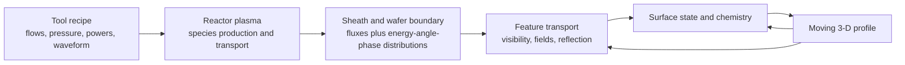
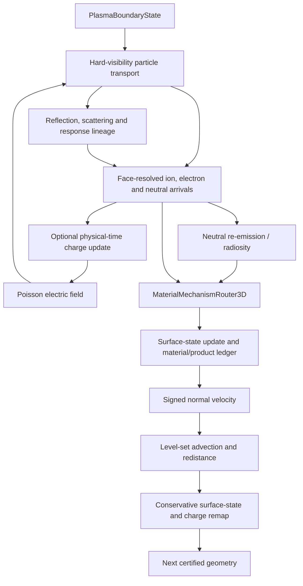
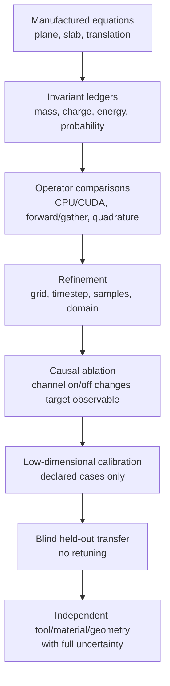
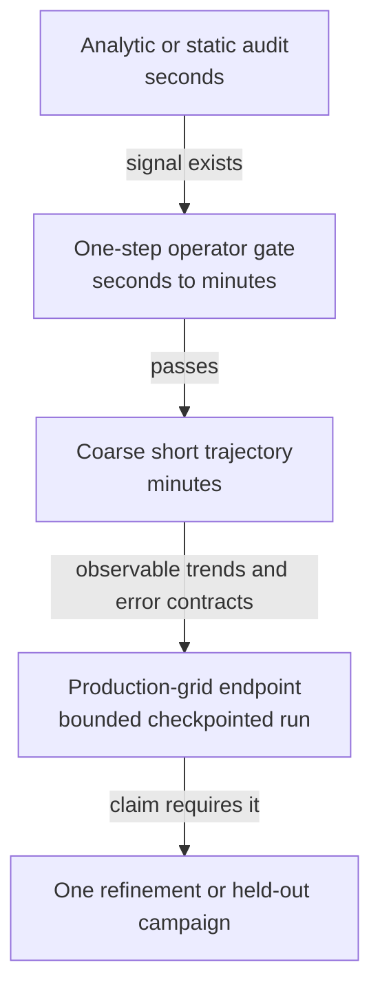

# Physics-first model of the unified petch engine

Competitive strategy: [`COMPETITIVE_DIFFERENTIATION_ROADMAP_2026-07-17.md`](COMPETITIVE_DIFFERENTIATION_ROADMAP_2026-07-17.md)
Resona partner scope: [`RESONA_PATTERN_TRANSFER_PARTNERSHIP_2026-07-17.md`](RESONA_PATTERN_TRANSFER_PARTNERSHIP_2026-07-17.md)
ViennaPS source audit: [`VIENNAPS_CODEBASE_AUDIT_2026-07-17.md`](VIENNAPS_CODEBASE_AUDIT_2026-07-17.md)
Numerics/calibration/AMR plan: [`NUMERICS_CALIBRATION_AMR_PLAN_2026-07-17.md`](NUMERICS_CALIBRATION_AMR_PLAN_2026-07-17.md)
Governing execution campaign: [`VALIDATION_FIRST_SUPERSET_CAMPAIGN_2026-07-17.md`](VALIDATION_FIRST_SUPERSET_CAMPAIGN_2026-07-17.md)

Date: 2026-07-17
Status: governing design and claim boundary; this is not itself a validation report

This document is the current mental model for building, testing, and using petch. It separates
what the engine solves from what must be supplied, calibrated, or validated. Older physics summaries
contain useful historical results but sometimes mix legacy demonstrations with capabilities the common
engine has not re-earned. When they disagree about the present claim boundary, this document and the
machine-readable validation ledger take precedence.

The separate `PHYSICS_AI_ACCELERATION_ROADMAP_2026-07-17.md` describes how learned operators can
accelerate this exact engine without changing the physics or claim boundary defined here.

## 1. Product definition

petch is first a **feature-scale forward process model**:

> Given a material geometry, a physical plasma boundary at the wafer, material-specific interaction
> laws, and numerical tolerances, predict the evolving surface, surface state, deposited charge,
> delivered species fluxes, profile observables, uncertainty, and validity.

The complete industrial aspiration is recipe-to-profile prediction, but recipe-to-profile contains an
upstream reactor problem that cannot be silently inferred by the feature solver:

The common engine is strongest from the wafer boundary to the profile. It has a versioned contract for
reactor providers, but it is not yet a validated full-reactor solver. Until that changes, the honest
product descriptions are:

1. **Measured-boundary mode:** measured or independently reconstructed wafer distributions in;
   profile prediction out.
2. **Provider mode:** a PIC, fluid, global, HPEM-like, or reduced reactor model supplies the boundary;
   petch supplies feature response and optional homogenized surface feedback.
3. **Tool-family reduced mode:** a calibrated surrogate maps a declared tool/recipe domain to wafer
   boundaries with applicability and uncertainty.

Mode 1 is the fastest path to a dependable product. Mode 3 is likely the fastest path to recipe-level
utility. A fully coupled reactor-feature digital twin is a later layer, not a prerequisite for proving
the feature engine.

## 2. Scale separation and why one mesh is the wrong abstraction

The problem spans distinct spatial and temporal scales:

| Layer | Typical scale | Resolves | Passes downstream |
| --- | --- | --- | --- |
| Reactor | cm, microseconds to seconds | power deposition, gas chemistry, diffusion, wall loss | species fluxes and plasma state near wafer |
| Sheath | sub-mm to mm, RF period | charged-particle acceleration and phase dependence | ion/electron energy-angle-phase distributions |
| Feature | nm to micrometres, trajectory ps to ns | shadowing, local fields, reflection, surface access | face-resolved arrivals |
| Surface state | atomic layers to films, ms to seconds | coverage, activation, polymer, removal and products | normal interface velocity and emitted populations |
| Profile | nm to micrometres, seconds to minutes | evolving topology and dimensions | new geometry and reactor feedback summaries |

The reactor cannot afford nanometre cells, while the feature model cannot derive chamber-scale species
production from a final SEM. The correct multiscale architecture exchanges distributions and integrated
feedback rather than forcing all physics onto one grid.

Feature charging is a fast state relative to profile motion in ordinary continuous etching. The
quasi-static limit is therefore useful: charge relaxes at each slowly changing geometry. For pulsed or
chopped bias comparable to the charge-relaxation time, the same physical-time charge machinery must run
time-resolved; a quasi-static result is then invalid.

## 3. State carried by the common engine

The engine state is not just a signed-distance field. A reproducible checkpoint contains:

- the combined level set and material-local level sets;
- material ownership;
- material-local surface state and its mesh fingerprint;
- surface charge or conductor-component charge when charging is enabled;
- physical time and adaptive-step controller state;
- immutable plasma-boundary and mechanism manifests;
- sampling mode, seed/epoch state, numerical controls, source revision, and checksums;
- exact conservation ledgers and bounded numerical closures.

That state permits continuation after a small profile change without resetting chemistry or charge. It
also prevents a convenient but invalid restart from silently becoming a different physical experiment.

## 4. One authoritative feature update

All profile phenomena should traverse this path. Benchmark names, expected answers, aspect ratios, and
surface-region labels may not enter governing equations as hidden switches.

## 5. Governing physics

### 5.1 Boundary distributions

For every species, the boundary state declares a dimensional flux and a normalized joint distribution
over the variables that matter:

\[
f_s(\mathbf{x}, E, \Omega, \varphi, t), \qquad
\int f_s\,d\mathbf{x}\,dE\,d\Omega\,d\varphi = 1.
\]

The feature engine should not replace a missing distribution with a benchmark-shaped guess. A reduced
distribution is legal only after quadrature/compression error is certified against the fuller source.

### 5.2 Collisionless feature transport

When the feature dimension is much smaller than the gas mean free path, particles follow characteristics:

\[
\frac{d\mathbf{x}}{dt}=\mathbf{v}, \qquad
m_s\frac{d\mathbf{v}}{dt}=q_s\mathbf{E}.
\]

Neutral particles use \(q_s=0\). Hard triangle visibility determines the first physical impact. Shared
edges and grazing events are certified and selectively replayed at higher precision; visibility is not
softened to help a solver.

If feature-scale gas collisions become important, they require a declared collision operator and cross
sections. They must not be impersonated by an aspect-ratio attenuation factor.

### 5.3 Surface response and lineage

An impact may react, reflect, emit a secondary population, or escape. A response kernel has the form

\[
K_{m,s}(E_{out},\Omega_{out},s_{out}\mid E_{in},\Omega_{in},\mathbf{z}_m),
\]

where \(m\) is material and \(\mathbf{z}_m\) is its surface state. Every cascade retains lineage and
closes number/rate, signed charge, energy, and material inventories. An incomplete cascade may be
continued or bounded; it may not be silently discarded.

### 5.4 Diffuse neutral re-emission

Repeated neutral re-emission is a surface integral problem. The common engine uses a conservative
radiosity-like solve:

\[
\mathbf{J}_{out}=\mathbf{J}_{source}+\mathbf{R}\mathbf{F}\mathbf{J}_{out},
\]

where \(\mathbf{F}\) is the visibility/form-factor operator and \(\mathbf{R}\) contains material- and
state-dependent nonreaction probabilities. The audit must close

\[
\text{source}=\text{reacted}+\text{escaped}
\]

within declared tolerance.

### 5.5 Surface chemistry and material exchange

Surface mechanisms evolve bounded intensive state and extensive inventories:

\[
\frac{d\mathbf{z}_m}{dt}=
\mathcal{R}_m(\mathbf{z}_m,\{\Gamma_s,E_s,\Omega_s\},T).
\]

Removal and growth rates are assembled from incident flux times a sourced probability or yield. A
generic channel looks like

\[
R_j=\Gamma_s P_j(\mathbf{z}_m,E,\theta,T).
\]

Removed material must be assigned to volatile product, transported product, redeposited material, or an
explicit unresolved inventory. A scalar etch velocity without a corresponding material ledger is not
sufficient for a predictive common-engine mechanism.

### 5.6 Charging and electrostatics

On insulating surfaces,

\[
\frac{d\sigma}{dt}=J_i-J_e-J_{leak}.
\]

The field follows the declared electrostatic model, ideally

\[
\nabla\cdot(\epsilon\nabla\phi)=-\rho,
\]

with physical permittivity, conductors, dielectric storage, and grounded boundaries. Charged-particle
trajectories then feed back through \(\mathbf{E}=-\nabla\phi\).

Fresh randomized-QMC scrambles represent the ensemble-mean current without accumulating a persistent
finite-sample bias. Frozen samples remain useful for replay and controlled comparisons, but a frozen
finite sample must not define the physical-time equilibrium. A final state is scored with unused samples.

Charging is enabled by causality, not prestige: if charge-on/off delivered flux and profile increments
are indistinguishable within uncertainty, the cheaper uncharged path is appropriate for that process.

### 5.7 Profile evolution

The interface evolves by a Hamilton-Jacobi equation:

\[
\frac{\partial\phi}{\partial t}+v_n|\nabla\phi|=0.
\]

The sign of \(v_n\) carries removal versus growth. Material-local level sets prevent mask, substrate,
polymer, and deposited films from silently becoming one material. The profile timestep is limited by
resolved displacement and topology, not by the particle flight time.

The Krueger 5 nm refinement exposed a one-node material-ownership island. Eight corner nodes are the
minimum support for one resolved hexahedral volume. The accepted policy suppresses only a newly born
component with fewer than eight unique nodes when every selected node changed owner during that
candidate step. Its count and volume upper bound are reported. Existing fragments or components with
eight or more nodes still cause a hard topology refusal.

### 5.8 Stochastic twisting

Mean-field charging predicts the expected profile. Twisting from finite arrivals is a distributional
observable. For a realization interval \(\Delta t\), arrival counts scale as

\[
N_s\sim\operatorname{Poisson}(\Gamma_s A\Delta t).
\]

Independent realizations must produce onset-aspect-ratio, lateral-displacement, and twist-probability
distributions. A single realization is never a deterministic prediction. A symmetric geometry must
have no systematic ensemble-mean twist direction unless an explicit asymmetry is supplied.

## 6. Which physics produces which profile feature

| Feature | Minimal causal ingredients | Frequent confounder |
| --- | --- | --- |
| Absolute depth | correct wafer flux, energy-dependent yield, material density, time | an unknown reactor flux can masquerade as a yield error |
| ARDE / RIE lag | neutral conductance/reaction, angular ion delivery, evolving coverage | empirical AR attenuation can fit one geometry and fail transfer |
| Bowing | mask-facet geometry plus differential ion reflection/scattering | an incorrect ion angular distribution |
| Microtrenching | grazing reflection and floor-corner focusing | mesh/visibility leakage at shared edges |
| Necking or clogging | mask/polymer deposition versus energetic removal | treating a coating as the underlying material |
| Notching | dielectric charging, Poisson field, ion deflection, evolving insulating interface | unconverged or sample-biased charge state |
| Twisting | finite arrivals, 3-D charge, geometry feedback, ensemble statistics | presenting one random realization as a forecast |
| Selectivity | independent material states and yields | reusing substrate chemistry on the mask |

## 7. What is universal and what is process-specific

### Universal numerical/physical infrastructure

- dimensional boundary distributions;
- hard-visibility transport and electrostatic work;
- response lineage and conservation;
- neutral surface-to-surface transport;
- material routing and inventory ledgers;
- Poisson coupling and physical-time charge evolution;
- level-set kinematics, adaptive stepping, remap, checkpoints;
- uncertainty, validity, refusal, and provenance.

### Process-specific closure data

- species identities and fluxes;
- energy-angle-phase distributions;
- reaction probabilities and state equations;
- sputter/etch/reflection/SEE kernels;
- material densities, permittivity, conductivity, and temperature dependence;
- product identities, launch laws, and sticking probabilities.

The engine can be general without pretending these inputs are universal. “First principles” means
conservation and governing relationships are enforced, while uncertain microscopic inputs are sourced,
bounded, calibrated in a declared split, or refused. It does not mean every reaction rate is derived from
electronic structure inside the feature simulation.

## 8. Current evidence boundary

### Reliably verified in the common engine

- versioned dimensional plasma boundary and reactor-provider contracts;
- deterministic and sampled hard-visibility transport with CPU/CUDA gates;
- certified edge/grazing replay and complete response lineage;
- conservative diffuse neutral radiosity;
- material-local mechanisms, surface state, and signed material ledgers;
- adaptive multi-material level-set evolution with checkpoint/resume;
- bounded subcell solid, gas-cavity, and newly born material-label closures;
- physical-time charging, Poisson coupling, charge remap, and exact charge ledgers;
- charged and uncharged profile paths through the same feature-step operator;
- finite-arrival ensemble infrastructure and geometry-native twist/notch/bow observables;
- strict validation, calibration-reveal, and held-out scoring contracts.

These statements mean the operators pass manufactured, invariance, conservation, parity, or refinement
tests. They do not mean an unseen wafer profile has been predicted accurately.

### Development or causal evidence, not formal validation

- ViennaPS-like transport/radiosity comparisons;
- de Boer development fits and failure diagnostics;
- Jeong reactor/sheath closure audits;
- charging-on/off causal audits;
- Nozawa/Giapis smoke and mechanism demonstrations;
- ALE, Bosch, cryogenic, and other reduced-module paper replays that have not all migrated through the
  common product path with untouched held-out outcomes.

### Still unearned

- a formally successful independent held-out feature-profile validation;
- recipe-to-wafer reactor prediction across tools;
- quantitatively validated Nozawa/Giapis notch depth;
- quantitatively validated bowing and microtrenching transfer;
- N>=30, refinement-stable twisting statistics against experiment;
- universal mask/polymer/product chemistry;
- routine seconds-scale high-resolution 3-D evolution;
- end-to-end differentiability through transport, converged charging, remap, and profile loss.

The formal held-out validation count is currently **zero**. That is a claim-discipline statement, not a
statement that every operator is wrong.

## 9. Why previous experimental campaigns did not close

| Campaign | What was learned | Why it is not a held-out success |
| --- | --- | --- |
| de Boer | exposed profiles revealed chemistry/boundary miss; transport mechanisms improved | data became development data and the quantitative miss remained |
| Jeong | a collisionless virtual-sheath change supplied only a small fraction of the required trend flattening | missing reactor/species response remained and profiles were exposed |
| Nozawa/Giapis | charging, topology, digitization, and notch infrastructure were exercised | the signed numerical/charging ladders and untouched strict campaign never completed |
| Krueger | two base observables calibrate two declared physical closures; transfer boundaries are checksum-bound | held-out oxygen/power profiles remain sealed pending the 5 nm freeze |

The recurring lesson is that an SEM endpoint does not identify the upstream reactor boundary and the
surface mechanism simultaneously. Calibration must be low-dimensional and transfer must be judged on
conditions not used to choose the closure.

## 10. Validation ladder

Definitions:

- **Verification:** did we solve the declared equations correctly?
- **Causal evidence:** does a mechanism change the expected observable in the expected direction?
- **Calibration:** which bounded unknown inputs fit declared calibration observations?
- **Validation:** did the frozen model predict untouched observations within a declared uncertainty and
  applicability contract?

Passing a unit test cannot replace validation. Matching a calibration SEM cannot replace held-out
transfer. A held-out miss may diagnose the model, but after inspection that dataset becomes development
data forever.

## 11. Cheapest decisive tests

The preferred experiments are small tests that isolate one claim:

1. **Transport:** open plane, straight trench, and hole; source equals impact plus escape; CPU/CUDA and
   estimator agreement.
2. **Radiosity:** one absorbing and one re-emitting cavity; source equals reaction plus escape; ray/order
   refinement.
3. **Reflection:** straight wall with grazing ions; a microtrench-like floor-corner flux peak appears
   when reflection is on and vanishes when off.
4. **Charging:** flat Maxwellian barrier, manufactured capacitor, and one dielectric trench; charge-on/off
   delivered-flux change plus timestep/sample/init refinement.
5. **Moving materials:** translating interface, receding interface, mask/substrate router, no-op remap,
   and manufactured topology events.
6. **Chemistry:** zero-flux, saturation, energy-threshold, material-ledger, and time-step gates before a
   profile run.
7. **Experimental transfer:** one base calibration followed by a small blind sweep whose boundary inputs
   are independently known.

## 12. Compute discipline: long runs must be earned

No scientific question starts with a multi-hour run. Use the following funnel:

Required before a long run:

- one external observable and one hypothesis;
- exact configuration and data split;
- a cheap estimate of runtime from measured step cost and expected accepted-step count;
- a wall-clock segment budget, checkpoint cadence, and maximum resume count;
- an early trajectory diagnostic showing the gating observable moves toward a useful decision;
- a kill rule and a statement of what action each possible result authorizes.

Default ceilings for development work:

| Stage | Default wall budget | Output |
| --- | --- | --- |
| Static/one-step diagnostic | 1-5 minutes | operator error and conservation |
| Short coarse path | 10-20 minutes | trend and runtime projection |
| Calibration endpoint | 30 minutes per checkpoint segment | durable state and metrics |
| Fine-grid refinement | one earned case only | numerical uncertainty |
| Held-out campaign | parallel bounded cases after freeze | prediction, not tuning |

A run that reaches its wall budget checkpoints; it does not restart. A recoverable work limit is handled
inline or by a supervisor. Conservation breach, unresolved physical topology, corrupted state, or a
validity-domain violation remains a hard stop.

## 13. Current Krueger decision path

The Krueger campaign is testing whether the common feature engine transfers a two-observable base
calibration to untouched oxygen-ratio and low-frequency-power conditions.

1. Base calibration used only mask opening and etch depth.
2. The two permitted closures are a bounded mask crosslink-growth blend and an oxide yield amplitude.
3. Charging was disabled only after a paired high-sample causal audit found negligible floor-ion effect
   for this high-energy process; charging remains part of the engine and is required where causal.
4. The 10 nm base endpoint completed.
5. The fixed-parameter 5 nm endpoint is the one mandatory numerical refinement.
6. A one-node mask-label topology event produced the bounded R1.7 closure described above.
7. Only after the 5 nm gate passes may the reveal be checksum-frozen and the eight held-out cases run.
8. Held-out outcomes cannot change a parameter or mechanism. A miss becomes a decomposed limitation.

The fine run is expensive because halving a 3-D grid increases cell count, halves admissible surface
motion per update, and resolves more topology events. It is certification work, not the routine product
path.

## 14. Near-term product and science sequence

1. Finish the single Krueger refinement or stop at its predeclared numerical gate.
2. Freeze the exact operator and run the blind Krueger transfer once.
3. If boundary-conditioned transfer succeeds, package measured/provider boundary mode as the first
   validated product slice.
4. If it fails coherently across process conditions, diagnose the reactor-boundary or mechanism response;
   do not add feature numerics indiscriminately.
5. Run a strict Nozawa/Giapis charged-notch campaign using the same common engine and bounded runtime
   funnel.
6. Run statistical twisting only after the mean charged profile is stable and only as an ensemble.
7. Add a reduced reactor provider for a declared tool family; a full reactor solver is optional until
   evidence shows the reduced provider cannot meet the intended-use error budget.
8. Optimize runtime after physics lock: narrow-band/AMR geometry, GPU-resident mesh/state operations,
   transport reuse with an error indicator, and parallel held-out/UQ cases.

## 15. Non-negotiable invariants

- no benchmark-shaped governing branches;
- no tuning on held-out outcomes;
- no silent particle, charge, energy, or material deletion;
- no soft visibility substituted for the final operator;
- no frozen finite-sample physical-time equilibrium claim;
- no volume Boltzmann electron density added without declaring a new plasma model;
- no cross-material deposition represented as growth of the target material;
- no quasi-static claim for a waveform faster than charge relaxation;
- no single stochastic profile presented as deterministic twisting;
- no convergence-criterion change without refinement evidence and explicit review;
- no long run without a compute ceiling, checkpoint, decision rule, and cheaper precursor.

## 16. What “done” means

The feature-engine milestone is complete when one frozen common-engine configuration:

- passes conservation and operator/refinement gates;
- calibrates only declared uncertain physical inputs on a declared base set;
- predicts a complete untouched transfer set within its honest uncertainty/applicability contract;
- replays from a clean installation and signed manifest;
- produces the same accepted profile on accuracy-matched CPU and CUDA paths;
- finishes within a published runtime envelope or refuses with a useful diagnosis.

The broader recipe-to-profile milestone additionally requires a validated reactor-boundary provider.
That provider can be measured, reduced, surrogate, fluid, hybrid, or PIC-based; it need not be the same
numerical code as the feature engine. The unification contract is the physical boundary and feedback,
not one monolithic mesh.
