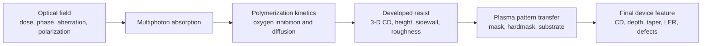

# Resona pattern-transfer partnership thesis

Date: 2026-07-17

Status: product and scientific scoping document. This is not a claim that petch has already
validated a Resona process. The Krüger blind-transfer campaign remains in progress as of this
revision.

Related architecture: [`PHYSICS_AI_ACCELERATION_ROADMAP_2026-07-17.md`](PHYSICS_AI_ACCELERATION_ROADMAP_2026-07-17.md)

## 1. Executive thesis

Resona controls how photons create a developed resist pattern. A semiconductor customer ultimately
cares about the pattern transferred into a hardmask or functional device material. Petch can be of
service at that interface:

> Given Resona's developed-resist geometry, material stack, etcher recipe, and a small calibration
> set, predict the final etched geometry and determine how the written pattern should be
> pre-compensated to reach the target device dimensions.

The first engagement should be a narrow, falsifiable pattern-transfer pilot, not a promise of a
universal fab simulator. One calibration condition should predict at least two untouched conditions.
The useful deliverable is a process window and pre-compensation map, not merely an attractive
simulated cross-section.

## 2. What Resona is building

The user/partner has confirmed that Resona is developing multiphoton maskless projection
lithography. Publicly indexed evidence is consistent with that description:

- Resona's public site describes the company as "commodifying the angstrom" but discloses little
  technical detail: https://www.resonasemi.com/
- A public conference-paper listing names "Large-scale projection nanolithography at sub-50nm half
  pitch using multiphoton polymerization," with Arun Nagpal, Md. Ehsanul Karim, and Robert Socha:
  https://www.researchgate.net/scientific-contributions/Md-Ehsanul-Karim-2346649589
- The public company profile identifies Resona as a privately held semiconductor-manufacturing
  company founded in 2025: https://www.linkedin.com/company/resona-semiconductor

The partner-supplied description is authoritative for this scoping exercise. Publicly unconfirmed
details such as throughput, exact wavelength, resist formulation, projection architecture, achieved
defectivity, and commercial resolution must not be inserted into a predictive model as facts.

## 3. The complete physical chain



Multiphoton voxel formation is not only an optical-threshold problem. Nonlinear dose deposition,
polymerization kinetics, oxygen, quencher loading, mass transport, beam shape, numerical aperture,
fill factor, phase, and polarization can all change voxel geometry. A recent compact-model example
is:

- https://doi.org/10.1117/12.3099525

The developed resist is then exposed to ions, reactive radicals, and plasma VUV photons. Those
populations can change its composition, density, crosslinking, carbonization, roughness, sputter
yield, and selectivity while the pattern is being transferred. A useful review/dissertation entry
point is:

- https://doi.org/10.13016/qjww-yod8

At small pitch the imaging layer may be too thin to transfer directly into the target material, so
a Si-containing intermediate layer and/or carbon hardmask may amplify its etch resistance. This
means a lithography system cannot be judged solely by its developed resist CD. The transferred CD,
sidewall, defectivity, and usable process margin are the product-level quantities.

## 4. Where petch can help immediately

The shortest useful interface begins after resist development:

```text
Resona measured or simulated developed-resist geometry
                         |
                         v
Petch material stack + plasma-boundary + feature transport
                         |
                         v
Predicted hardmask/substrate profile and uncertainty
                         |
                         v
Etch-aware correction to Resona's written geometry or dose
```

For a declared stack and recipe family, petch can target:

- final top, middle, and bottom CD;
- etch depth and sidewall angle;
- mask-height loss and lateral mask erosion/growth;
- necking, clogging, bowing, footing, notching, and microtrenching when the applicable channels are
  present;
- pitch-dependent loading and aspect-ratio-dependent transport;
- sensitivity to resist height, initial sidewall, plasma flux, ion energy-angle distribution, and
  gas mixture;
- a forward map from written geometry to etched geometry;
- an inverse pre-compensation map from desired etched geometry to written geometry.

Charging, secondary emission, and surface conduction are not switched on merely because the engine
contains them. They are promoted only when the material stack and causal audits show that they
matter for the selected Resona transfer problem.

## 5. ViennaPS comparison

ViennaPS is a strong and extensible process-topography framework. It already provides mature
level-set evolution, ray tracing, multiple materials, custom process models, and prebuilt plasma
etching models. Its fluorocarbon model explicitly includes etchant, polymer-depositing species,
ions, passivation coverage, polymer removal, and positive normal growth when deposition dominates:

- https://viennatools.github.io/ViennaPS/
- https://viennatools.github.io/ViennaPS/models/prebuilt/fluorocarbonEtching.html

Consequently, ViennaPS can be useful to Resona today if a knowledgeable team supplies a suitable
custom material law and wafer boundary. It can predict approximate profile evolution and mask
deposition/erosion. It should remain a runtime and profile baseline for petch.

The differentiator sought by petch is not that ViennaPS is incapable of moving a surface. It is the
integration of deeper state and evidence:

| Dimension | ViennaPS strength | Petch objective |
| --- | --- | --- |
| Surface evolution | Mature, fast C++/level-set framework | Conservative multi-material evolution with explicit refusal/error ledgers |
| Feature transport | Mature Monte Carlo/ray-tracing infrastructure | Energy-angle-resolved kinetic lineages, hard visibility, reflection, and field feedback |
| Surface chemistry | Flexible rate/coverage models and useful prebuilt mechanisms | Finite per-material inventories with sourced reaction parameters and declared omissions |
| Charging | Not the central documented fluorocarbon path | Kinetic charge/Poisson/profile co-evolution when causally required |
| Reactor boundary | User supplies process-model inputs | Measured or independently modeled wafer flux/IEAD provider with provenance |
| Validation | User-controlled | Calibration/held-out separation, checksums, refinement, uncertainty, and claim refusal |
| Current maturity | High | Still being validated and optimized |

Petch is not automatically better. ViennaPS currently wins on maturity, speed, and breadth of
production use. Petch becomes more useful for Resona only if the added physics and evidence produce
better untouched experimental predictions or materially better process decisions.

## 6. What has actually been calibrated in the current Krüger campaign

The current development campaign calibrates two physical closures on one base SEM:

1. `effective_mask_crosslinked_growth_fraction`: a bounded blend between published fresh-film and
   crosslinked-film radical attachment probabilities; the base mask opening identifies it.
2. `oxide_etch_yield_scale`: a multiplier on the reference-yield amplitudes of the published
   energetic SiO2-removal laws; the base etch depth identifies it.

The current pre-refinement values are approximately 0.8934 and 0.5668, respectively. The mandatory
5 nm base refinement may earn one update to the same pair using the same two base observables. No
held-out profile may influence that update.

Not fitted: sidewall shape, maximum width, remaining mask thickness, oxygen-ratio trend, power
trend, clogging transitions, or held-out endpoints. If the frozen pair predicts those untouched
outcomes, it is evidence for a transferable causal mechanism rather than an endpoint scale fit.

That evidence would be relevant to Resona, but it would not validate a Resona material stack. Each
new stack still needs its own input evidence and held-out transfer.

## 7. Smallest credible first-partner pilot

### Scope

- One lithographic pattern family: line/space or contact-hole array.
- One resist/hardmask/substrate stack.
- One etch-tool recipe family.
- One calibration condition.
- At least two precommitted held-out conditions that vary pitch, written CD, resist height, or one
  etch control.
- Two-dimensional center-section modeling is permitted for a truly invariant line/space pattern;
  holes and stochastic/azimuthal questions require 3-D.

### Resona supplies

- pre-etch developed-resist metrology for every condition, preferably a 3-D surface or multiple SEM
  sections rather than nominal layout alone;
- resist formulation class and density, or enough blanket data to infer bounded effective values;
- full layer stack, thicknesses, and material identities;
- etcher identity/configuration and recipe: gas flows, pressure, source power, bias waveform/power,
  temperature, duration, and pulsing;
- blanket etch rates/selectivities for resist, hardmask, and target material where available;
- post-etch cross-sections and measurement uncertainty;
- an explicit designation of calibration versus held-out wafers before fitting begins.

### Petch supplies

- a checksum-bound input manifest and geometry ingest;
- a declared wafer-boundary reconstruction, with uncertainty when diagnostics are incomplete;
- one material mechanism for the selected stack, with every fitted parameter named and bounded;
- grid, timestep, sampling, and geometry-metrology refinement checks;
- a blind prediction for each held-out condition;
- an error decomposition separating lithography input error, boundary uncertainty, surface-model
  uncertainty, and numerical uncertainty;
- a written-CD-to-final-CD transfer curve and initial etch-aware pre-compensation table;
- a profile movie and plots tied to conserved material and mechanism channels.

## 8. Calibration and reveal contract

The pilot must be difficult to fool:

1. Freeze raw pre-etch and post-etch metrology with checksums.
2. Declare calibration and held-out samples before fitting.
3. Calibrate no more parameters than are independently identified by calibration observables and
   blanket evidence.
4. Prefer physical parameters or bounded reduced closures over direct output scale factors.
5. Freeze source, boundary data, parameters, and numerical settings before opening held-out
   outcomes.
6. Predict held-out profiles once.
7. Report misses without retuning. After reveal, a miss may become development data only if a new,
   separately held-out experiment is reserved.

The primary pass criterion should be chosen with Resona before execution. A useful initial contract
is that held-out top/middle/bottom CD and depth lie inside combined experimental and numerical
uncertainty, while the correct categorical failure mode is predicted. A weaker development result
can still be useful if its error decomposition identifies the next measurement unambiguously.

## 9. Product deliverable

The first deliverable should answer a manufacturing question:

> What geometry should Resona write, and what plasma window should the customer run, to obtain the
> requested final material geometry with declared margin?

Outputs:

- written CD versus final CD;
- depth, taper, and mask-budget response surfaces;
- sensitivity ranking for exposure-derived geometry and etch controls;
- predicted safe, marginal, and failing regions based on explicit physical limits;
- representative uncertainty bands;
- exact-solver profiles for selected corners;
- a fast design-mode evaluator only after it is checked against exact results.

## 10. How the Arena Physica framing enters

The Arena-oriented plan lives in
[`PHYSICS_AI_ACCELERATION_ROADMAP_2026-07-17.md`](PHYSICS_AI_ACCELERATION_ROADMAP_2026-07-17.md).
Its relevant principle is:

```text
exact engine = teacher + verifier + fallback
learned operator = fast proposal + interpolation inside demonstrated support
experiment = external judge
```

Resona is a strong eventual data-factory partner because its lithography system can generate a
controlled distribution of initial geometries. The exact etch engine can label how those geometries
transfer. A geometry-native learned operator can then accelerate inverse design across thousands of
candidate write patterns, while exact simulations certify finalists and out-of-distribution cases.

Neural acceleration is not required for the first pilot. The correct order is:

1. validate one exact transfer mechanism;
2. profile and accelerate the exact solver;
3. formalize immutable training records;
4. train a one-step/profile surrogate;
5. use the surrogate for inverse-search proposals;
6. verify selected results with exact physics and experiment.

## 11. Important current gaps

Before claiming a Resona-ready predictive product, petch still needs:

- at least one completed strict held-out feature-profile validation;
- a Resona-specific resist/hardmask mechanism rather than assuming the Krüger amorphous-carbon law
  transfers;
- plasma VUV/resist modification if causal tests show it affects selectivity or roughness;
- a validated recipe-to-wafer reactor/sheath provider or sufficient diagnostics from Resona's etch
  tool;
- robust geometry ingestion from their metrology/CAD representation;
- quantified line-edge/linewidth roughness propagation when it matters;
- significant runtime improvement for design-window exploration;
- a partner-approved IP, data-retention, and deployment boundary.

These gaps are scoped. They do not require rewriting the geometry/transport engine. They require one
new material adapter, one boundary integration, metrology ingest, validation data, and subsequent
performance work.

## 12. One-paragraph partner pitch

Resona is developing a new way to write nanoscale resist patterns without masks. Petch would help
turn those printed resist patterns into reliable device features. For one selected material stack,
Resona would provide pre-etch geometry, recipe information, and a small calibration/validation wafer
set. Petch would predict mask loss, CD bias, depth, taper, deposition, and transfer failures, then
return an etch process window and a write pre-compensation rule. The engagement succeeds only if a
model calibrated on one condition predicts untouched wafers within agreed uncertainty. This gives
Resona a credible photon-to-device story and gives petch an industrial validation with a clear path
to fast inverse-design software.
