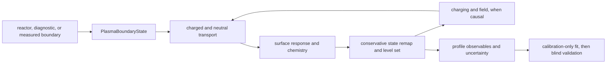
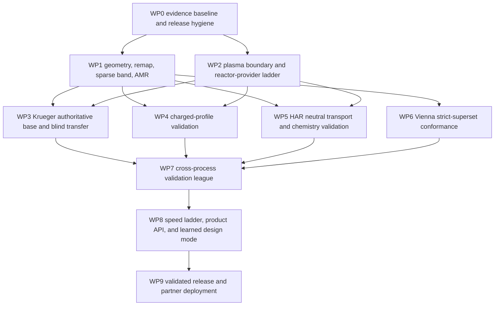
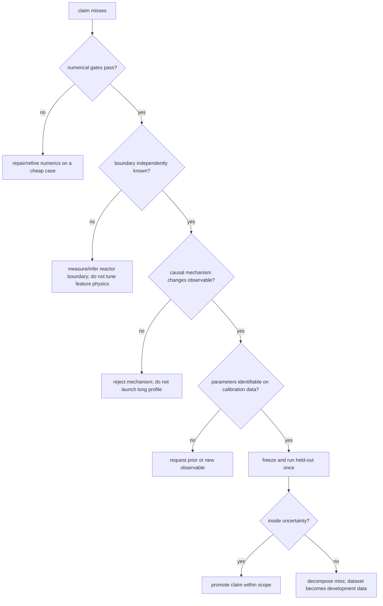

# Unified engine validation execution program

Date: 2026-07-17
Status: large-scale governing program; subordinate campaign plans supply detailed protocols
Scope: one unified plasma-to-feature engine, experimentally judged, with bounded compute and explicit adaptive branches

This document does not replace the signed scientific contracts in the repository. It organizes them
into one execution program and defines how work may adapt as evidence arrives without drifting into
solver roulette, benchmark-specific branches, premature held-out inspection, or unbounded simulation.

Primary inputs:

- [`VALIDATION_FIRST_SUPERSET_CAMPAIGN_2026-07-17.md`](VALIDATION_FIRST_SUPERSET_CAMPAIGN_2026-07-17.md)
- [`PHYSICS_FIRST_UNIFIED_ENGINE_2026-07-17.md`](PHYSICS_FIRST_UNIFIED_ENGINE_2026-07-17.md)
- [`NUMERICS_CALIBRATION_AMR_PLAN_2026-07-17.md`](NUMERICS_CALIBRATION_AMR_PLAN_2026-07-17.md)
- [`AMR_IMPLEMENTATION_AUDIT_2026-07-17.md`](AMR_IMPLEMENTATION_AUDIT_2026-07-17.md)
- [`KRUEGER_2024_VALIDATION_PROTOCOL_2026-07-16.md`](KRUEGER_2024_VALIDATION_PROTOCOL_2026-07-16.md)
- [`JEONG_2023_REACTOR_CLOSURE_AUDIT_2026-07-16.md`](JEONG_2023_REACTOR_CLOSURE_AUDIT_2026-07-16.md)
- [`CHARGING_C3_CLOSURE_AUDIT_2026-07-14.md`](CHARGING_C3_CLOSURE_AUDIT_2026-07-14.md)
- [`EXPERIMENTAL_VALIDATION_MATRIX.md`](EXPERIMENTAL_VALIDATION_MATRIX.md)
- [`VIENNAPS_CODEBASE_AUDIT_2026-07-17.md`](VIENNAPS_CODEBASE_AUDIT_2026-07-17.md)
- [`VIENNAPS_TOPOLOGY_CONFORMANCE_2026-07-17.md`](VIENNAPS_TOPOLOGY_CONFORMANCE_2026-07-17.md)
- [`ENGINE_RUNTIME_FAILURE_POLICY.md`](ENGINE_RUNTIME_FAILURE_POLICY.md)

## 1. North-star outcome

The product is not a collection of benchmark scripts. It is one engine that accepts a versioned
plasma boundary, material stack, geometry, chemistry, waveform, and numerical accuracy contract and
returns:

- evolving material geometry;
- dimensional ion, electron, and neutral delivery;
- conservative surface state and reaction ledgers;
- optional self-consistent charging, reflection, redeposition, and stochastic arrivals;
- profile observables with numerical, boundary, experimental, and model uncertainty separated;
- a reproducible refusal when the requested claim lies outside the implemented physics.

The scientific success criterion is frozen-model prediction of untouched experimental profiles. The
engineering success criterion is unattended completion or a useful, classified refusal within a
published runtime envelope. Both are required.



There is one authoritative feature-update path. Process-specific mechanisms plug into it; they do
not fork transport, remapping, charging, geometry, or evidence semantics.

## 2. Honest starting point

The current branch contains a large intentional work-in-progress atop commit `d995a01`. After
promoting the exact-periodic, real-checkpoint-certified form-factor visibility path, the complete
local suite passes `820 passed, 1 skipped`. This is verification evidence, not wafer validation.

### What is already earned

- dimensional boundary and reactor-provider contracts;
- hard-visibility transport with certified float64 replay and CPU/CUDA gates;
- diffuse neutral radiosity and energetic reflection with closed ledgers;
- material-local surface mechanisms, conservative inventories, and multi-material level-set motion;
- physical-time charging, Q1 Poisson, conservative charge remap, fresh-scramble evolution, and
  unattended recovery rules;
- topology-aware gas-cavity enclosure and reopening without weakening unrelated refusals;
- common notch, bow, depth, opening, and twist observables;
- calibration/reveal/held-out contracts and source-checksummed experimental ingest;
- a public-engine keyhole close/continue/reopen proof and a real Krueger checkpoint continuation to
  `60 s` with exact material conservation;
- one repaired-operator Krueger base-only run from `t=0` to `60 s`, completed unattended in
  `467.55 s` on an RTX 4090 with exact material conservation and no topology refusal.

### What is not yet earned

- a successful formal held-out feature-profile validation; the count remains zero;
- a clean authoritative Krueger base endpoint and blind oxygen/power transfer;
- quantitative Nozawa/Hwang--Giapis notch prediction through the common engine;
- an independently validated de Boer/HAR transfer after the exposed development dataset;
- a predictive Jeong boundary from the reported reactor data;
- validated bowing, microtrenching, or twisting statistics;
- routine seconds-scale high-resolution 3-D evolution;
- recipe-to-wafer prediction across tools without a validated boundary provider.

The latest Krueger base-only response check is useful but not authoritative. It reached `60 s` with
depth `853.2188 nm` and minimum mask opening `45.0854 nm`, versus base targets `825 nm` and `45 nm`.
The engine and numerical execution gates passed, but the old endpoint response model failed its
precommitted prediction gate (`rho = -1.3955`). The candidate sequence is therefore closed. The old
response crossed a repaired-remap operator epoch and the late grid discrepancy is unresolved, so the
result cannot authorize another chemistry point or a held-out reveal. Held-out oxygen/power profiles
remain sealed.

## 3. Evidence and claim discipline

Every result receives exactly one primary evidence label:

| Label | Meaning | May support a product claim? |
| --- | --- | --- |
| V | analytic/manufactured verification, conservation, refinement, parity | only that the declared equations were solved correctly |
| C | causal ablation or mechanism evidence | only that the channel changes the observable as predicted |
| S | comparison to another simulation | only simulation conformance, never experiment |
| E3 | calibrated experimental result | yes, with the fitted quantities and applicability named |
| E4 | untouched held-out experiment | yes, within the frozen model and uncertainty contract |
| D | development data already inspected or used for choices | no held-out claim; useful for mechanism development |

No work package may promote its own evidence class merely because a run completed. A mixed-operator
trajectory is `D`; a Vienna match is `S`; a calibration-case match is `E3`; only a frozen transfer to
untouched observations can become `E4`.

## 4. Program dependency graph



WP1 and WP2 may proceed in parallel because they answer different questions: the feature operator
must be numerically trustworthy, while the source boundary must be physically identified. No feature
mesh can repair a wrong reactor boundary, and no reactor model can repair nonconservative geometry.

### 4.1 Large-task and subtask operating model

The work packages are the stable tasks. Subtasks are disposable, evidence-producing increments under
one work package; they may be reordered or replaced as results arrive, but they may not silently
change a work package's scientific exit gate.

| Large task | Active bounded subtasks | Evidence that closes the current increment | Expensive work held behind it |
| --- | --- | --- | --- |
| WP0 integrity | operator-epoch contract; artifact index; clean-install regression | checksum-bound calibration/prediction refusal across epochs; full suite | any formal freeze or release |
| WP1 numerics | coupled surface-state/radiosity diagnostic; uniform backend seam; shared transfer and sparse/AMR manufactured tests | step-doubled chemistry/radiosity convergence plus conservative translation/recession/seam/pinch gates | another `60 s` Krueger profile |
| WP2 boundary | Krueger base-only boundary receipt; Jeong identifiability audit; provider API | source-plane/flux/moment closure with uncertainty | full reactor build |
| WP3 Krueger | reproduce `0.5 s` 10/5-nm truth with refined/AMR operator; one authority endpoint | same-operator numerical authority and base tolerance | held-out oxygen/power reveal |
| WP4 charging | source-faithful Nozawa ingest; bounded charging stationarity; off/on causality | timestep/sample/grid/init agreement plus notch movement | profile ensemble and twisting campaign |
| WP5 HAR | de Boer/Jeon evidence split; neutral/chemistry ablations | independent boundary plus held-out profile score | additional chemistry parameters |
| WP6 comparison | Vienna public-case parity and capability ledger | matched inputs, geometry, observables, and error/runtime | product superiority claims |
| WP7--WP9 product | cross-process scorecard; runtime ladder; partner boundary contract | at least one E4 result, one charged transfer, clean install/API | surrogate/foundation-model authority |

Each active subtask must declare: the question, cheapest adequate experiment, pass/fail threshold,
maximum wall/compute budget, durable artifact, and both successor branches. A failed subtask closes a
hypothesis; it does not reopen parameter roulette. Large-task status changes only when the recorded
exit gate changes.

## 5. Work packages

## WP0 — Evidence baseline, worktree closure, and reproducible release

**Purpose:** turn the current large WIP into a stable base without losing campaign evidence or
rewriting functioning physics.

**Deliverables:**

- group durable changes into reviewable engine, mechanism, campaign, and documentation commits;
- preserve curated audits and minimal restart checkpoints; checksum raw campaign archives outside
  ordinary Git; ignore only reproducible operational ephemera;
- regenerate the validation ledger against exact source/configuration hashes;
- install the built wheel in a clean environment and run the public common-engine smoke;
- retain atomic checkpoints, heartbeats, recoverable inline work, and the P/A/B/C/D runtime-failure
  taxonomy.

**Entry evidence:** current regression and `git diff --check` pass.
**Exit gate:** clean-install smoke, full regression, source/data checksums, and a named artifact index
all agree; no result path depends on an undocumented scratch file.
**Compute budget:** local CPU only; normally less than 20 minutes per verification cycle.
**Stop condition:** any unexplained regression, missing provenance, or artifact checksum mismatch.

**Adaptive branch:** a regression local to one implementation cluster blocks only that cluster's
commit, not read-only analysis or independent manufactured work elsewhere.

## WP1 — Production geometry: topology, remap, sparse narrow band, and AMR

**Purpose:** make ordinary profile evolution robust and fast enough that experimental campaigns are
not dominated by uniform-grid cost or fragile triangle correspondence.

**Current status:** gas-cavity closure/reopening works through the public engine and the real Krueger
checkpoint. The present periodic exact point-to-triangle remap is an R0/R1 development solution;
overlap-conservative transfer and AMR remain open. Vienna demonstrates that implicit topology
continuation and sparse narrow-band geometry are routine production behavior. The live uniform path
now routes both surface-extraction points through the read-only backend seam with exact legacy parity.
In parallel, a standalone surface/radiosity integrator has passed its manufactured DAE gates but remains
unwired until uncertainty-controlled form-factor refinement closes SC2. The 8/16/32-ray checkpoint
ladder establishes stable integrated oxide response but exposes unresolved local fluorocarbon-growth
ray-level sensitivity. Finite-triangle area integration and exact-periodic cellwise visibility are now
the shared production operator. The latter matches all `14,664` float64 checkpoint events exactly;
the legacy path disagreed on `991` and shifted `5.6463%` of area-weighted transport. Independent
scrambles are still required to turn the remaining level sensitivity into a sampling uncertainty;
`FORM_FACTOR_ACCURACY_AUDIT_2026-07-17.md` now owns the bounded FF0--FF5 repair. A standalone immutable triangle-surface
primitive has also passed exact/periodic/material-local query parity against brute force; overlap
transfer, BVH acceleration, and live remap wiring remain open.

**Large increments:**

1. certify the continuous profile observables, especially minimum opening near grid crossings;
2. complete the topology/remap conformance suite: translation, retriangulation, periodic seam,
   disappearance/creation, multi-material pinch, cavity closure/reopening, and repeated round trips;
3. introduce reusable BVH/AABB correspondence and explicit exposed/removed/new surface classes;
4. implement conservative triangle-overlap transfer for extensive inventory and monotone transfer for
   intensive state;
5. benchmark a sparse narrow-band implementation before general AMR;
6. add 2:1-balanced interface AMR with conservative volume/surface prolongation and restriction.

**Evidence gate:** every new operator must reproduce the uniform-grid manufactured truth, retain exact
material ledgers, and converge under refinement. AMR must reproduce uniform `5 nm` short-burst Krueger
observables inside the uniform-grid uncertainty at lower cost. It is not allowed a compensating
physical parameter.

**Compute budget:** manufactured cases on local CPU in seconds/minutes; one initial paired `10/5 nm`
Krueger burst on GPU, hard-capped at ten minutes per case plus startup; no `2.5 nm` full run; no invalid
`20 nm` comparison that changes the physical periodic cell.

**Stop conditions:** topology differs between nominally equivalent grids, remap crosses a material
junction, a ledger fails, a continuous observable depends on one marching-cubes row, or AMR is not
cheaper at matched error.

**Adaptive branches:**

- scalar smooth coarse/fine rate discrepancy -> carry it into WP3 multi-fidelity calibration;
- localized corner/junction discrepancy -> finish overlap remap/AMR before calibration;
- different topology -> fix geometry; never calibrate it away;
- sparse band provides enough cost reduction -> defer full AMR until a campaign still needs it.

## WP2 — Plasma boundary and reactor-provider ladder

**Purpose:** supply feature-scale distributions from measurements or a reactor model without building
a monolithic chamber-to-angstrom mesh or guessing missing species trends inside the feature solver.

**Provider ladder:**

```text
measured/checksummed wafer distributions
                 ↓ if incomplete
diagnostic-constrained reduced global/sheath provider
                 ↓ if boundary error dominates validation
2-D/axisymmetric transport or reactor surrogate
                 ↓ only if the reduced provider fails its error contract
full reactor plasma/PIC-MCC or externally coupled HPEM-class provider
```

All providers emit the same `PlasmaBoundaryState`: species, absolute flux, joint energy/angle/phase
density, charge, mass, reference plane, waveform, uncertainty, and provenance. The feature engine must
not know which provider produced it.

**Immediate scientific targets:**

- preserve the checksummed Krueger HPEM-derived flux/IEAD boundary for base and held-out conditions;
- keep Jeong stopped at the boundary-under-determined verdict until species-resolved ion flux/IEAD,
  radical wall fluxes, and hot-neutral production are measured or modeled;
- ingest the public Bosch/OES/wafer dataset for reactor-state inference and held-out wafer prediction;
- define a partner-mode boundary contract for Resona or another early partner: tool data in, wafer
  distributions plus uncertainty out.

**Evidence gate:** open-wafer flux/current invariants, species/energy moments, sheath limits, source-plane
invariance, and independent diagnostic or held-out wafer agreement. A fitted boundary may not use the
same feature profile later claimed as validation unless that profile is explicitly calibration data.

**Compute budget:** inversion/static audits in minutes; reduced-provider training or calibration in
hours but checkpointed; no full reactor solver until a quantified boundary error exceeds the intended
feature-profile error budget.

**Stop conditions:** non-identifiable boundary parameters, missing source measurements, incompatible
species chemistry, or a provider whose uncertainty alone exceeds the profile claim tolerance.

**Adaptive branches:**

- measured distributions sufficient -> use them directly and defer reactor development;
- reduced provider closes held-out wafer moments -> productize it;
- coherent profile misses track boundary uncertainty -> promote reactor fidelity;
- misses persist with independently known boundaries -> investigate surface mechanism, not reactor
  complexity.

## WP3 — Krueger: first authoritative calibration and blind transfer

**Purpose:** earn the first formal held-out feature-profile result with the current unified engine.

**Fixed experimental contract:** base opening `45 nm` and depth `825 nm` calibrate exactly two physical
closures: mask crosslinked-growth blend and oxide-yield amplitude. The oxygen-ratio and low-frequency-
power profiles remain sealed. Ten-nanometre runs propose; uniform `5 nm` or certified AMR is authority.

**Execution sequence:**

1. preserve the completed R1.9 base-only response check and its mechanical
   `reject_response_model` receipt; do not fit another 10 nm chemistry point;
2. bind every response, reveal, and prediction to the executable operator epoch;
3. use archived checkpoints for a zero-duration parameter-by-geometry/state diagnostic;
4. certify conservative remap and sparse-band/AMR operators on manufactured cases;
5. reproduce the paired `10/5 nm`, `0.5 s` evidence with one current operator and a continuous
   opening observable;
6. run at most one clean `t=0 -> 60 s` authoritative base at uniform 5 nm or certified AMR;
7. freeze source, boundary, mechanism, numerics, parameters, seeds, and reveal manifest;
8. run all eight held-out cases once, close artifacts before reading measurements, then reveal and
   score with no retuning.

**Evidence gate:** clean authoritative base inside declared tolerances, exact ledgers, endpoint operator
audit, refinement evidence, parameter identifiability, bounded runtime, and held-out boundary provenance.

**Compute budget:** trust proposal and static audits in minutes; diagnostic GPU segments at most one
hour with exact checkpoints; one long base is earned only after measured preflight; held-outs run as
bounded independent jobs after freeze, never as exploratory tuning.

**Stop conditions:** base parameters become non-identifiable, predicted/actual trust-region improvement
is repeatedly inconsistent, topology/numerics dominate the observable, required held-out boundary inputs
are missing, or a clean run would cross an unrecorded operator transition.

**Validation claims:**

- base match -> `E3`, naming both fitted observables and both fitted closures;
- untouched oxygen/power success -> `E4` within the boundary and operator contract;
- held-out miss -> honest decomposed result, not a failed engine rewrite and not permission to retune.

## WP4 — Charged-profile validation: Nozawa, Hwang--Giapis, bowing, and twisting

**Purpose:** convert the verified charging machinery into experimentally judged charged-profile
prediction without reopening frozen-map root solvers or letting one charging transient run forever.

**Current status:** physical-time fresh-scramble charging is the reference formulation; historical
frozen-sample root/Jacobian paths are closed. The common engine has charge conservation, Poisson,
charged reflection, moving-surface charge remap, stationary-window diagnostics, topology, and notch/bow/
twist observables. Existing Nozawa/Hwang replays are smoke, mechanism, or simulation-reference evidence,
not quantitative experimental validation.

**Large increments:**

1. close the source-faithful 2-D/3-D charging reference gates with fresh-scramble terminal windows,
   timestep/sample/grid/init ladders, and the retained per-node diagnostics;
2. certify the Cl2/poly-Si/oxide surface and reflection channels on manufactured limits;
3. run a bounded charging-off/on Nozawa campaign for notch depth versus open area/connectivity, with
   only the preregistered calibration data exposed;
4. score absolute profile shape, notch depth, asymmetry, and uncertainty, not a red-over-gray smoke;
5. after the mean charged profile is stable, run N>=30 3-D hole realizations for twist probability and
   onset AR, including N/sample doubling and the zero-direction isotropy control;
6. use the same engine for bowing/microtrenching only when reflection/charging ablations identify the
   causal channel.

**Evidence gate:** exact charge/material/particle ledgers, hard visibility, endpoint unused-sample audit,
charging off/on causality, numerical refinement, independent final scoring, and no benchmark-shaped
voltage or current law.

**Compute budget:** flat/trench existence and stationarity probes in minutes; one short charged-profile
pilot before any full profile; no single charging realization may consume an unbounded GPU; ensemble
realizations are parallel bounded jobs with checkpoints.

**Stop conditions:** fresh-scramble stationary windows disagree under timestep/init refinement, exact
charge conservation fails, the boundary is underdetermined, or the charged channel does not materially
move the claimed profile observable.

**Adaptive branches:**

- stationary charged state and causal notch -> proceed to experimental transfer;
- charged state stable but notch wrong -> investigate Cl2 surface/removal/redeposition, not charging
  solvers;
- no stable stationary state under both explicit and PTC-equivalent evolution -> discrete-equilibrium
  audit under refinement;
- twist distribution unstable under N doubling -> increase ensemble evidence, never report one path as
  deterministic prediction.

## WP5 — HAR neutral transport and chemistry validation

**Purpose:** validate ARDE and deep-feature behavior without confusing transport variance, exposed
development data, and missing surface chemistry.

**Current status:** the former de Boer held-out claim was withdrawn. Direct Figure-9 data are development
data. The common Belen SF6/O2 mechanism and certified reflection reduce the miss but do not validate.
The old deep-floor collapse was substantially Monte Carlo under-sampling; deterministic conductance is a
better reference for rare deep neutral delivery. Charging-throttle causality was refuted for that gap.

**Large increments:**

1. certify deterministic radiosity/conductance against high-sample MC and analytic asymptotes at matched
   error, including rare deep-floor delivery;
2. complete temperature, passivation, chemical-F, ion-assist, sputter, product, and mask-law causal
   audits without adding profile-shaped corrections;
3. use the exposed de Boer points only for development and mechanism discrimination;
4. preregister a different independent ARDE/profile experiment for held-out transfer;
5. migrate Bosch/cyclic and one additional chemistry through the same surface-state/profile contracts.

**Evidence gate:** calibrated parameters have physical bounds and independent observables; transport,
chemistry, and moving-grid errors are separately reported; an untouched experiment decides prediction.

**Compute budget:** frozen transport and surface-state tests in seconds/minutes; moving-profile bursts
before full duration; a full HAR path only after the initial slope and runtime projection are stable.

**Stop conditions:** estimator error exceeds the claimed rate, surface parameters are unidentifiable,
multiple chemistry channels fit the same calibration observables, or the only remaining dataset has
already been used for development.

**Adaptive branches:** transport discrepancy -> improve deterministic/importance estimator; chemistry
discrepancy with known boundary -> add only a causally evidenced state/channel; lack of independent data
-> acquire/reserve data rather than manufacture validation.

## WP6 — ViennaPS strict-superset conformance

**Purpose:** ensure petch is no worse on ordinary topography while its additional physics remains
conservative and experimentally useful.

ViennaPS remains a separate executable pinned to immutable commit
`2956ed587984c6dc38be24c6e2390e10c9b2f0a7` (`4.6.1+2956ed`). Do not copy current GPL implementation
into a differently licensed core without an explicit product/legal decision.

**Conformance suite:** translating plane, straight-trench conductance, sticking/re-emission, energetic
reflection, polymer deposition, multi-material advection, Bosch composition, pinch-off/cavity/reopening,
periodic translation, and CPU/GPU behavior. Both engines are scored against analytic/manufactured truth
first and each other second.

**Evidence gate:** matched-error accuracy, runtime, completion/recovery behavior, and exact provenance.
Petch earns “strict superset” only when it is no worse on shared basics and its extra channels improve an
untouched experiment.

**Compute budget:** local small cases in seconds/minutes; no GPU until CPU truth gates close; benchmark
only at matched error, not matched nominal ray count or grid label.

**Stop conditions:** comparator configuration is not physically equivalent, a license boundary is
crossed, or performance differences are reported without accuracy equivalence.

## WP7 — Cross-process validation league

**Purpose:** prevent one successful benchmark from becoming a universal-physics claim.

After Krueger, run independent campaigns with frozen splits:

1. Nozawa/Hwang--Giapis charged notching;
2. one independent HAR/ARDE experiment, not exposed de Boer Figure 9;
3. Jeong only after reactor boundary closure;
4. one Bosch/cyclic profile dataset;
5. one partner stack/pattern with at least two untouched profiles;
6. one additional chemistry/material family such as SF6/O2, HBr/O2, or spatial ALE.

Every campaign reports calibration count, physical parameter count, boundary source, numerical and
experimental uncertainty, held-out score, runtime, failure class, and Vienna/other comparator where
applicable.

**Promotion rule:** a mechanism becomes a reusable product default only after transfer across at least
one unseen condition. A chemistry becomes a platform claim only after a second geometry or process
window. A reactor provider becomes recipe-predictive only after a held-out wafer condition.

**Stop condition:** no independent data remain. The correct action is a new experiment or partner data
agreement, not rebranding development data.

## WP8 — Runtime ladder, product API, and learned design mode

**Purpose:** make the validated engine usable without replacing its authority with an opaque surrogate.

Optimization order:

1. eliminate redundant work and reuse transport only under an error indicator;
2. sparse narrow-band geometry and AMR from WP1;
3. GPU-resident mesh/state operations and batched independent realizations;
4. reduced-order reactor providers from WP2;
5. immutable exact simulation records and multi-fidelity response models;
6. learned surrogate or neural operator for seconds-scale design queries, with OOD detection and exact
   verification of proposed optima and window corners.

**Evidence gate:** speed is reported at matched error and includes startup, recovery, and uncertainty
cost. A surrogate may propose; only the exact engine or experiment certifies.

**Target service levels:** seconds for surrogate/design response, minutes for reduced/coarse screening,
and bounded hours for exact high-resolution certification. If exact certification still requires days,
the product must say so and schedule it asynchronously rather than hiding the cost.

## WP9 — Validated release and partner deployment

**Purpose:** package the engine as an auditable predictive service.

**Release gate:**

- one clean-install replay from a signed manifest;
- at least one E4 feature-profile transfer;
- published evidence matrix with limitations;
- measured CPU/CUDA accuracy and runtime ladder;
- versioned boundary, geometry, material, mechanism, and numerical schemas;
- input-validity reporter that refuses unsupported pulsed/quasi-static, chemistry, SEE, conduction, or
  boundary claims;
- partner report separating measured inputs, calibrated closures, predictions, uncertainty, and next
  information needed.

The first partner deliverable should be narrow and credible: one stack/tool family, one calibration
condition, at least two untouched predictions, and a runtime/error contract. “Universal etch simulator”
is not a release criterion.

## 6. Compute authorization ladder

Every run must move through this funnel:

| Tier | Typical work | Default wall budget | Required output before promotion |
| --- | --- | ---: | --- |
| T0 | analytic/static/frozen operator | 1--5 min | signal, conservation, and a decision |
| T1 | one-step or short coarse trajectory | 10--20 min | trend, noise estimate, step cost, runtime projection |
| T2 | diagnostic GPU/checkpoint resume | <=1 h segment | durable checkpoint, heartbeat, gate metrics, stop reason |
| T3 | authoritative calibration endpoint | measured and approved before launch | one operator, exact provenance, independent endpoint audit |
| T4 | frozen held-out campaign | bounded independent jobs after freeze | predictions closed before reveal; no tuning |

Before T2 or above, the manifest must state:

- the one question the run answers;
- the observable and pass/fail threshold;
- why a cheaper tier cannot answer it;
- measured seconds per accepted step and projected accepted-step count;
- checkpoint cadence, wall segment, maximum resumes, and failure taxonomy;
- what each possible result authorizes next.

Wall-budget exhaustion produces a checkpoint, not a restart. Recoverable numerical work extends inline
without changing operator/state/epoch. Integrity failures retain the last certified state and stop.

## 7. Adaptive execution rules

The program may adapt autonomously within these boundaries.

### May proceed without reopening strategy

- read-only audits, history/provenance checks, plots, and artifact indexing;
- manufactured or analytic tests;
- monotone numerical refinement within a declared operator;
- bounded checkpoint resume under an already declared policy;
- one trust-region proposal that uses calibration data only;
- stopping an idle external compute resource after artifact verification;
- documenting a failed gate and selecting the already declared branch.

### Requires an explicit decision record before proceeding

- a new fitted physical parameter or reaction channel;
- changing calibration/held-out splits;
- reading a sealed outcome early;
- changing a convergence or uncertainty contract;
- a full reactor solver, general AMR rewrite, or unbounded GPU campaign;
- direct incorporation of GPL source into the product core;
- presenting a development or simulation-reference result as validation.

### Universal decision tree



## 8. Immediate bounded queue

### 8.1 Live execution board — 2026-07-17

This board is deliberately subordinate to the stable work packages. A row may change when its
experiment answers the stated question; the parent exit gate and held-out firewall do not change.

| Parent | Active subtask | Cheapest decisive evidence | Hard budget | If it passes | If it fails |
| --- | --- | --- | ---: | --- | --- |
| WP1 surface transport | integrate the certified physical-support statistic into the Stage-A controller | periodic 40-over-20 nm footprint, fixed-footprint integrated gate, support-eligible mean gate, all-ineligible refusal | seconds, CPU; no Stage-A launch | serialize one common patch contract and permit a bounded short-horizon rerun | repair the measurement instrument only; no ray/profile run |
| WP1 surface transport | unpromoted row-selective nested-RQMC primitive | manufactured selected-row/global-row equivalence, exact untouched-row identity, count/provenance/refusal gates | <=2 min, CPU; no real checkpoint | retain only as reusable infrastructure | remove the isolated increment; campaign still uses uniform levels |
| WP1 surface transport | one uniform paired 16->32 short-horizon receipt | current patch contract, directly verified motion bound, same eight scrambles and exact hard visibility | <=5 min total CPU, stop at first failed gate | close FF3 or expose the next quantified sampling rung | hold Stage B; run analytic reciprocity-control experiment before more rays |
| WP1 geometry | generalize the passed planar overlap primitive to orientation-local moving surface groups | wall/floor/corner partition, retained/removed/new exposure ledgers, exact fallback refusal | <=2 min verification, CPU | compare against live remap on a short manufactured feature step | retain standalone planar authority and keep legacy live remap |
| WP3 Krueger | same-operator 10/5 nm short-burst equivalence | matched `0.5 s` depth/opening/state and ledger evidence | <=10 min per case after measured preflight | earn one authority endpoint | localize numerics before calibration |
| WP2/WP4/WP5 | boundary and validation data mapping | provenance/identifiability tables only | no long simulation | preregister the next campaign | request missing data; do not invent a boundary |

The core physical-support instrument is implemented and its focused integration cluster passes. It
does not drop any patch from inventory: integrated error still gates every patch against a fixed
represented footprint, while a local mean is gated only where the mesh covers at least the declared
fraction of that footprint. The controller wiring is the active increment. No real-checkpoint
computation may start until that single patch contract is serialized and tested end to end.

The first two Stage-A launches on 2026-07-17 stopped at the declared `60 s` direct-transport
sub-budget before any replicated form factor was evaluated. The repeated timeout after JIT caches
were warm establishes that this is real operator cost, not compilation noise; no physics conclusion
was drawn. The active repair is not a looser scientific gate: persist the exact direct transport as a
hash-bound, shape-checked artifact, allow at most `120 s` for its one-time construction inside the
unchanged `300 s` Stage-A ceiling, and reuse it only when checkpoint, source epoch, operator,
configuration, and transport seed identities all match. A cache mismatch must recompute or refuse;
it must never silently replay another operator epoch.

The repaired launch subsequently completed in `295.408 s` with status `bounded_precision_hold`.
Integrated SiO2/mask recession and mask growth, exact ledgers, radiosity balance, nested sampling,
and the paired R19-R17 direction pass. Local 20/40 nm flux/film confidence and 8->16 patch refinement
do not; the worst level-16 patch receipt is about `48.5x` tolerance. The current horizon also predicts
about `0.73 dx` local motion versus the `0.05 dx` frozen-geometry limit. The active WP1 subtask is now
selected-source row allocation plus a derived shorter common horizon. Stage B, global 32 rays, and
all profile/held-out work remain held.

The selected-source allocator then closed its exact signed adjoint decomposition to `2.96e-15` and
separated a measurement artifact from the remaining estimator error. If barely supported patch
slivers are admitted, 90% of the ranking score appears to live on only `234/1833` source rows
(`12.77%`). On physically supported patches, 90% requires `758/1833` rows (`41.35%`). The predeclared
25% cap selects 458 rows and captures only `78.99%`, so the allocator correctly returns
`diffuse_source_error_blocker`; it does **not** authorize a real selected-row run. Its derived common
horizon is `dt_next/1024 = 1.218024e-4 s`, with a linearly predicted `0.02468 dx` maximum motion, but
that prediction still requires direct verification.

This result also changes the cost decision. The exact direct solve consumed `104.390 s`, whereas all
8/16 replicated form-factor tracing completed in only a few seconds; most remaining Stage-A time was
downstream response scoring. Row selection therefore attacks a reusable engine need but not the
dominant wall-clock cost of this checkpoint. A primary-source method audit selected the simpler
uniform nested 16->32 extension: it adds only `234,624` hard-visibility events, retains one sample
level on every row, and avoids same-data selection bias and mismatched reciprocal precision. That
decision record explicitly supersedes the old automatic-global-32 hold for **one short-horizon
receipt only**. A fixed affine reciprocity/closure control variate remains a manufactured-research
candidate; nonlinear nonnegative smoothing is not promoted because it introduces finite-sample bias.

The geometry audit selected WP1-AMR2a because block storage would otherwise multiply three different
remap semantics. Its deterministic periodic spatial index now preserves exact brute-force nearest
triangle/image/tie authority and runs the shared mixed-state transfer in `0.232772 s` versus
`0.265314 s` for the legacy path (`0.877x`) on 2,048 faces. It is deliberately not wired into the
live feature step: the legacy K-nearest heuristic has arbitrary equal-distance fourth-neighbor ties,
whereas the shared operator uses deterministic lower-face ownership. The next increment is therefore
overlap-conservative transfer with an explicit promotion gate, not silent replacement of one
heuristic by another.

The first exact-overlap increment now passes as a standalone authority for one coplanar oriented
patch with a small parallel normal offset. It uses indexed periodic candidate supersets and exact
float64 triangle clipping; periodic images combine by physical face pair. Extensive transfer closes
retained, removed, and newly exposed inventory separately, while intensive transfer is convex and
refuses undeclared newly exposed state. Identity, retriangulation, subdivision, shifted-periodic,
mixed-material, linear-convergence, and refusal tests pass (`33` focused tests). On 2,048 planar
faces it takes `0.055661 s` versus `0.228537 s` for indexed KNN (`0.244x`). It remains unpromoted
because real feature surfaces contain walls, floors, corners, curvature, and topology change; those
cases currently refuse rather than falling through silently. The next geometry increment must group
orientation-local patches and define the corner/topology authority before any live wiring.

### 8.2 Next bounded execution ladder

This is the run order after the current source edits settle. A lower rung must produce its durable
receipt before the next one starts.

1. **Patch-contract integration (seconds):** pass periodic-domain provenance and the `0.10` support
   rule through the Stage-A controller; retain all-patch integrated gates and diagnostics; refuse an
   all-ineligible comparison. This is a geometry-independent round threshold, not a value fitted to
   one benchmark; serialize sensitivity at `0.05/0.075/0.10/0.25/0.50/0.75`. It changes mean-field
   eligibility, never the all-patch integrated inventory or a physical tolerance.
2. **Estimator implementation (manufactured only):** finish or safely stop the isolated selected-row
   primitive, but do not wire it into Krueger. Extend the ordinary replicated controller to one
   uniform nested level 32 with the same eight scrambles. Complexity is not accepted merely because
   it saves rays.
3. **One short frozen checkpoint (hard capped):** only after steps 1--2, rebuild or replay direct
   transport under exact hash identity, directly verify the `dt_next/1024` motion bound, and evaluate
   8/16 plus at most one preselected refinement strategy. Stop at the first failed gate; no Stage B.
4. **Short geometry truth (not an endpoint):** if the frozen operator closes, run paired uniform
   10/5 nm and then AMR at `0.5 s`. Compare continuous opening, depth, state inventory, topology, and
   wall time. Do not run 2.5 nm or another 60 s endpoint.
5. **Only then calibrate and validate:** freeze the legal base parameters through the declared
   multi-fidelity trust region, reveal Krueger held-outs once, and move to strict Nozawa charging and
   HAR campaigns through the same engine. A held-out miss becomes development evidence; it never
   triggers hidden retuning.

The next work should remain narrow even though the program is large:

1. preserve the completed R1.9 result and its `reject_response_model` receipt; the 10 nm candidate
   sequence is closed and both external workers are stopped;
2. retain the completed operator-epoch binding: calibration reveals and held-out predictions must use
   one executable epoch; never reuse a response across the recovered pre-/post-periodic-remap boundary;
3. preserve the completed frozen access screen and positive-horizon results. The conservative
   chemistry/radiosity integrator is earned, but the 8/16/32-ray full-state receipts show local
   form-factor noise despite a converged integrated oxide direction. FF1 is now closed: finite-area
   launch plus the exact-periodic candidate matched all `14,664` float64 reference events, while the
   legacy operator produced `991` event mismatches and `5.6463%` area-weighted row TV. FF2--FF3 now
   have independent replicated scrambled-QMC control and roundoff-stable, retriangulation-invariant
   exact-overlap scoring at two fixed physical patch scales. Run only the bounded 8->16-ray Stage-A
   replicated patch screen next. Do not purchase a 32/64-ray scalar-only run or wire SC3 merely
   because global oxide is stable;
4. implement the AMR audit's bounded sequence: exact uniform backend wrapper, shared geometric
   transfer, fixed-resolution sparse band, then one 10/5 nm 2:1 hierarchy; pass manufactured
   translation, recession, conservation, periodic-seam, and pinch-off gates at each promotion;
5. reproduce the existing uniform `10/5 nm`, `0.5 s` evidence with AMR, then purchase at most one
   current-operator authority endpoint;
6. in parallel, continue local Vienna manufactured conformance and reactor-provider data mapping;
7. hold every held-out reveal, new charging campaign, and full reactor build until its package gate
   explicitly earns it.

This queue is deliberately not “run everything.” It closes the cheapest dependencies on the first E4
candidate while preserving independent work on the engine's lasting geometry and boundary layers.

## 9. Program completion criteria

The program has crossed the first product threshold when:

1. the common engine completes ordinary topology, state transfer, and recovery unattended;
2. a clean authoritative operator calibrates only declared physical closures;
3. that frozen operator predicts a complete untouched feature-profile transfer set inside honest
   uncertainty, or produces a decomposed miss with no hidden retuning;
4. at least one charged-profile and one HAR/chemistry campaign subsequently repeat that discipline;
5. petch is no worse than Vienna on shared truth-based cases at matched error;
6. the exact path has a measured bounded runtime and the fast path is certified against it;
7. a partner can supply a documented boundary/material/geometry deck and receive replayable results
   without repository archaeology.

The long-term differentiator is not that the engine never encounters uncertainty. It is that geometry,
transport, chemistry, charging, calibration, compute, and experimental evidence all remain inside one
auditable decision system—and every expensive run is purchased by a cheaper result that says why it is
needed.
