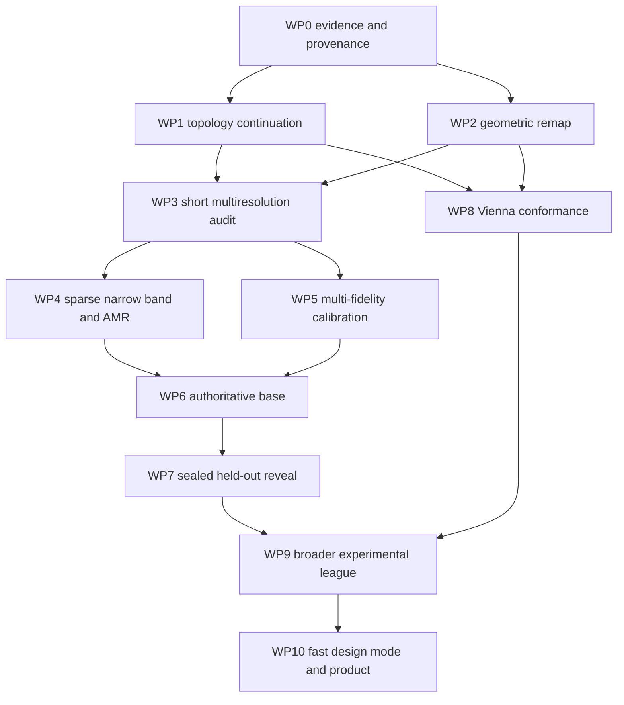

# Validation-first strict-superset campaign

Date: 2026-07-17
Status: governing execution plan; adapts by explicit evidence gates, never by held-out tuning

Related documents:

- [`UNIFIED_ENGINE_VALIDATION_EXECUTION_PROGRAM_2026-07-17.md`](UNIFIED_ENGINE_VALIDATION_EXECUTION_PROGRAM_2026-07-17.md)
- [`PHYSICS_FIRST_UNIFIED_ENGINE_2026-07-17.md`](PHYSICS_FIRST_UNIFIED_ENGINE_2026-07-17.md)
- [`NUMERICS_CALIBRATION_AMR_PLAN_2026-07-17.md`](NUMERICS_CALIBRATION_AMR_PLAN_2026-07-17.md)
- [`VIENNAPS_CODEBASE_AUDIT_2026-07-17.md`](VIENNAPS_CODEBASE_AUDIT_2026-07-17.md)
- [`COMPETITIVE_DIFFERENTIATION_ROADMAP_2026-07-17.md`](COMPETITIVE_DIFFERENTIATION_ROADMAP_2026-07-17.md)
- [`KRUEGER_2024_VALIDATION_PROTOCOL_2026-07-16.md`](KRUEGER_2024_VALIDATION_PROTOCOL_2026-07-16.md)

## 1. Objective

Build one production-worthy petch engine that:

1. matches mature topography solvers on ordinary geometry, runtime, and reliability;
2. adds dimensional boundaries, charging, lineage, conservative inventories, stochastic outcomes,
   uncertainty, and evidence contracts through the same code path;
3. calibrates the fewest identifiable physical closures on declared calibration data;
4. predicts untouched experimental profiles without retuning;
5. offers a fast design mode whose important answers are certified by the exact engine.

The immediate milestone is one honest Krüger base calibration followed by the sealed oxygen/power
transfer reveal. No claim of superiority is made before that result.

## 2. Current baseline

As of the latest evidence update:

- complete local suite: `686 passed, 1 skipped` before the latest bounded campaign utilities;
- no Krüger held-out profile has been opened;
- the 10 nm-calibrated pair is
  `effective_mask_crosslinked_growth_fraction=0.8934059741411972` and
  `oxide_etch_yield_scale=0.5667632723491973`;
- the exact 5 nm development checkpoint continued through gas-cavity enclosure at `56.939835 s`,
  reopening at `58.663674 s`, and completed at `60 s` with exact material conservation;
- its complete response is `900.8570 nm` depth and `39.4664 nm` minimum mask opening versus the
  base targets `825 nm` and `45 nm`;
- the trajectory remains development-only because the periodic remap repair entered at
  `56.482184 s` and the topology-continuation policy entered at `56.920695 s`;
- its audit/checkpoint/plots and receipt are archived under
  `results/krueger_2024_base_calibration_r18/mixed_operator_topology_continuation/`, with audit
  SHA-256 `98506d4b94fbdd48ed00baee254088c6e49fbd02321dcc2d799c2b0e7e5caa30`;
- the valid initial `10/5 nm`, `0.5 s` paired audit is complete: depth rate differs by `0.073%`,
  opening rate by `1.433%`, and mask-thickness rate by `1.033%`; the invalid 20 nm and late
  restricted comparisons remain excluded;
- the definition-correct final reopened mask opening is `39.46998 nm`; the reviewed observable uses
  the mask material level set, reports sealed throats as zero, and retains pocket width separately;
- the sole R1.9 response check completed at `45.085 nm` opening and `853.219 nm` depth. Its engine
  contracts pass, but the response prediction fails (`rho=-1.3955`), so the 10 nm candidate
  sequence is permanently closed and the campaign moves to the numerical-authority branch;
- the archived R17 source proves that its endpoint response belonged to the pre-repair remap epoch;
  every future calibration reveal and held-out prediction must checksum-bind one operator epoch.

## 3. Governing method

Every large claim has a direct, cheaper prerequisite:

```text
implemented equation
      ↓ manufactured verification
numerical operator
      ↓ short refinement / invariance
calibration closure
      ↓ identifiability + base-only fit
predictive claim
      ↓ blind held-out experiment
performance claim
      ↓ matched-error competitor benchmark
```

No long simulation is launched to answer a question that a frozen operator, short burst,
manufactured case, or existing checkpoint can answer.

## 3.1 Live execution board

| Work package | State | Current evidence / next gate |
| --- | --- | --- |
| WP0 evidence | active/pass | Prior archives and the new 10/5 audit were copied with byte-identical SHA-256. The retired Vast boxes were destroyed; fresh instance 45195298 runs the checksum-bound 5 nm authority work. |
| WP1 topology | implementation and real-checkpoint pass | Public-engine keyhole closes/continues/reopens without injected geometry. Real Krüger path enclosed at 56.9398 s, reopened at 58.6637 s, and completed at 60 s with exact material ledger. |
| WP2 remap | pass; common refinement selected and sealed | A paired two-step 5 nm CUDA receipt starts both backends from identical geometry/state and first-step geometry. Common refinement closes material exactly and remap conservation to 6.61e-16, agrees with indexed on global responses to 6.55 ppm or better, and runs 31.3% faster. Commit 12aee41 binds it through pilot, resume, freeze, and blind transfer. |
| WP3 multiresolution | initial pair, opening definition, and CUDA profile pass; late evidence open | At 0.5 s, 10/5 depth/opening/mask-thickness rates differ by 0.073%/1.433%/1.033%, while maximum/top width differs by 71.235%; global calibration observables may guide discrepancy modeling, but local shape is not authoritative. Unified CUDA matches the mixed-device reference to 1.02e-7 nm. |
| WP4 AMR | bounded sparse-volume no-go; optional | Fixed-dx sparse volume misses the 3x/2x memory/work gates and redistance is only 0.8% of the live step. The first authority is uniform 5 nm; AMR resumes only on a larger volume-dominated case or a new cost model. |
| WP5 calibration | controller pass; remap blocker closed | Generic low/high discrepancy fitting and actual/predicted trust-ratio control pass. The fixed R1.9 pair remains the anchor location, not a new fit; stale response derivatives remain refused. A miss at the clean anchor must earn a current-epoch direction before one correction. |
| WP6 authority | next bounded run | Start at t=0 on uniform 5 nm with commit-bound common refinement and the fixed R1.9 pair. This single base endpoint, not a sweep, decides freeze versus the one permitted base-only correction. |
| WP7 held-out | sealed | No held-out profile has been opened. |
| WP8 Vienna | T1 matched topology pass; paired suite open | At 12.5 nm ViennaLS closes at 1.9375 s, petch at 2.5625 s inside its one-cell-plus-checkpoint bound, and both reopen the prescribed cap at analytic 1.0 s. Profile-distance and multi-material cases remain. |

## 4. Dependency graph



## WP0 — Evidence preservation and unattended operation

### Deliverables

- every accepted step checkpoints geometry, material level sets, surface state, physical time, and
  adaptive-controller state;
- every run records engine/source checksums, configuration, seeds, hardware, ledgers, recovery/event
  counts, wall time, and status;
- remote artifacts are copied and SHA-256 verified locally before an instance is stopped;
- heartbeat/status files permit observation without interacting with the run;
- bounded automatic resume handles wall budgets and explicitly classified recoverable conditions.

### Gate

No result is authoritative when it spans an unrecorded operator transition. A mixed-operator result
may diagnose and propose only.

## WP1 — Topology-aware physical continuation

### Physics

An enclosed gas cavity is a geometry event, not the end of process time. After pinch-off, external
particles cannot reach the sealed interior, while exposed surfaces continue to etch/deposit. The
cavity may remain sealed, evolve, or reopen.

`terminal_feature_clogged` is therefore not a successful final status for this campaign. It is a
legacy diagnostic label for the missing continuation branch and cannot satisfy a base or held-out
endpoint.

### V1 allowed events

Continue gas-cavity enclosure/opening only when:

- solid-component count is unchanged;
- every material-component count is unchanged;
- open-domain gas breakthrough state is unchanged;
- the remap passes distance, boundedness, and conservation gates.

Record old/new gas-cavity counts, physical time, geometry signatures, surface-area change, state
transfer residuals, and accessibility on the next step.

### Refused events

- material component creation/destruction;
- solid fragmentation/merger without an explicit material closure;
- domain breakthrough/disconnect without a declared boundary event;
- nonlocal remap;
- conservation or state-capacity failure.

### Manufactured tests

1. two walls pinch into a sealed cavity;
2. process continues for multiple steps;
3. direct external flux on sealed faces is zero within estimator tolerance;
4. exposed cap receives flux;
5. cap removal reopens the cavity and access returns;
6. material/surface ledgers close through both events;
7. periodic translation gives the same result;
8. default/refusal policy remains testable and explicit.

### Real checkpoint test

Resume the exact `56.920695 s` Krüger checkpoint and continue to `60 s`. This is development
evidence only. Cap the invocation at one GPU-hour and preserve any new checkpoint.

## WP2 — Geometric surface-state remapping

### R0 now

- periodic nearest-image lookup;
- exact point-to-triangle distance certification after local candidate culling;
- material-local bounded interpolation;
- exact extensive area-integral correction.

### R1 production

- reusable BVH/AABB closest-surface search;
- symmetric geometry-distance audit where appropriate;
- explicit old/new exposed/removed area classification.

### R2 authoritative/AMR

- local old/new triangle overlap in a common tangent chart;
- extensive state transferred by overlap area;
- bounded monotone reconstruction for intensive coverages;
- uncovered new surface initialized by a declared physical closure;
- disappearing old surface assigned to the removal ledger;
- no material averaging across a junction.

### Gates

Bitwise no-op, translating/receding plane, periodic seam, retriangulated identical surface,
curvature convergence, discontinuous state, material junction, topology event, and repeated
refine/coarsen round trip.

## WP3 — Short multiresolution causal audit

### Runs

| State | Grid/operator | Physical interval | Purpose |
| --- | --- | --- | --- |
| Initial geometry | 20/10/5 nm | frozen rate + 0.5 s | shallow transport/rate convergence |
| Late archived geometry | 10/5 nm | frozen rate + 0.1--0.5 s | necking, junction, remap, accessibility |

Use paired boundaries, quadratures, seeds, material parameters, timestep targets, and observable
definitions. No 2.5 nm full run.

Preflight update (2026-07-17): nominal 20 nm is excluded because the engine's minimum three-node
axis rule realizes the published 130 × 20 nm periodic cell as 120 × 40 nm. It is a different
physical problem, not a coarse member of this refinement family. Direct aligned restriction of the
56.482594 s and 56.920695 s 5 nm checkpoints to 10 nm changes solid/cavity/material topology, so a
late paired audit at those states is also excluded. Use an earlier common-topology 5 nm checkpoint,
or wait for verified AMR prolongation/restriction. The initial paired 10/5 nm audit remains valid.

### Outputs

- face-resolved and patch-integrated velocity differences;
- ion/neutral first-hit and repeated-delivery differences;
- polymer deposition/removal and oxide-removal increments;
- depth/opening/topology increments;
- continuous-profile metric audit: minimum opening, its physical location, and stability under
  subcell cross-section sampling (a one-row marching-cubes flicker may not steer calibration);
- local state-remap errors;
- conservation and wall time;
- attribution: transport, geometry, chemistry integration, or remap.

### Decision

- mostly scalar smooth rate difference: promote multi-fidelity discrepancy calibration;
- localized corner/junction error: promote geometric overlap/AMR first;
- topology differs between 10 and 5 nm: do not calibrate away; refine topology operator;
- short results are unstable/noisy: improve estimator/timestep before any long run.

## WP4 — Sparse narrow band and true AMR

### Phase 1: sparse narrow band

Retain one global `dx` but allocate/evolve only the signed-distance band needed by the interface.
Benchmark memory, reinitialization, extraction, and end-to-end runtime. This is not AMR.

### Phase 2: block-structured AMR

- 2:1 balanced hierarchy;
- fine bands at interfaces, narrow gaps, curvature, material junctions, state/velocity/charge
  gradients, and topology-event regions;
- coarse bulk material and distant vacuum;
- conservative volume/surface prolongation and restriction;
- periodic coarse/fine neighbors;
- deterministic refinement decisions and restart state;
- consistent surface extraction and Poisson treatment.

### Gate

AMR must reproduce uniform 5 nm short-burst answers inside the uniform-grid uncertainty at lower
cost. It never receives a new physical parameter.

## WP5 — Multi-fidelity calibration

### Model

For calibration parameters `theta`, model the authoritative response as

```text
y_fine(theta) = y_coarse(theta) + discrepancy(theta)
```

Use a bounded local trust-region response for the present two parameters. Bayesian optimization is
reserved for a larger identifiable parameter set; a rectangular parameter grid is not acceptable for
hour-scale evaluations.

### Current development direction

The pre-clog values and existing base-only response matrix point toward:

- increasing crosslinked fraction to reduce mask-film growth;
- decreasing oxide-yield scale to reduce excessive depth.

The local coordinates around `f≈0.923`, `s≈0.546` are a proposal only. The censored state is not a
60 s response.

### Gates

- only base opening/depth enter the objective;
- all held-out outcomes remain unread;
- parameter bounds, response conditioning, correlation, and numerical uncertainty are reported;
- one proposal is evaluated at a time and the trust region accepts/shrinks based on actual versus
  predicted improvement;
- final parameters belong to the authoritative fine/AMR operator;
- inability to identify parameters triggers a data/physics request, not extra knobs.

## WP6 — One clean authoritative base

Entry requires WP1--WP5 gates relevant to the chosen operator.

Run from `t=0` to `60 s` with one source checksum and no operator transition. Required:

- complete time or explicitly continued topology events;
- depth and opening within declared calibration tolerance;
- diagnostic widths, mask thickness, asymmetry, and topology reported but not fitted;
- exact material/radiosity ledgers;
- numerical uncertainty from WP3/AMR evidence;
- independent endpoint operator audit;
- no unbounded recovery or wall-budget loop.

If it fails, held-outs remain sealed. The failure is classified as numerical, boundary, mechanism,
or identifiability evidence before another run is considered.

## WP7 — Frozen held-out Krüger transfer

After WP6 passes:

1. freeze source and boundary checksums, parameters, numerics, seeds, and reveal manifest;
2. execute all eight oxygen/power cases once with automatic checkpoints;
3. do not inspect experimental outcomes until every simulated artifact closes;
4. reveal and score categorical trends, scalar/full-profile metrics, uncertainty, topology, and wall
   time;
5. do not retune after reveal.

A miss becomes development data only after a new independent experiment is reserved.

## WP8 — ViennaPS strict-superset conformance

Run official ViennaPS as a separate black-box backend at upstream commit
`2956ed587984c6dc38be24c6e2390e10c9b2f0a7`.

### Initial paired cases

- translating plane;
- periodic straight trench;
- pinch-off, enclosed cavity, and reopening;
- sticking/re-emission sweep;
- energetic reflection;
- polymer deposition/necking;
- multi-material advection;
- CPU/GPU parity where available.

Both codes are scored against analytic/manufactured truth first. Matched-error runtime, completion,
and recovery/refusal behavior are reported. Petch becomes a strict superset only when it is no worse
on overlapping basics and its extra physics improves held-out evidence.

## WP9 — Broader experimental league

After Krüger:

1. Nozawa/Hwang--Giapis: charging/reflection and notch transfer;
2. de Boer: HAR radical conductance/ARDE with a still-untouched experiment reserved;
3. Jeong: close reactor/species boundary before new profile runs;
4. Resona: one stack/pattern calibration and at least two untouched profiles;
5. one additional chemistry such as SF6/O2, HBr/O2, or cyclic ALE.

Every campaign records calibration count, parameter count, boundary evidence, numerical uncertainty,
held-out error, runtime, and comparator.

## WP10 — Product speed and learned design mode

Only after one exact held-out success:

- immutable exact training records;
- response/geometry surrogate for a declared process window;
- OOD and uncertainty gates;
- active exact labeling;
- exact certification of proposed optima/window corners;
- seconds-scale design query and minutes/hours exact fallback.

The exact engine remains teacher, verifier, and fallback. Experiment remains the judge.

## 5. Compute discipline

### Local/manufactured

- default budget: minutes;
- no external GPU;
- complete targeted tests before full suite.

### Diagnostic GPU

- explicit wall budget, normally ≤1 hour;
- exact checkpoint every accepted step;
- heartbeat/status without interactive perturbation;
- no duplicate process;
- remote artifact sync and SHA verification before stopping instance.

### Long authoritative

- launched only after written gate review;
- projected time/cost from a measured preflight;
- automatic resume and bounded failure classification;
- no simultaneous uncontrolled operator changes.

## 6. Adaptive decision rules

The campaign may adapt without user interruption when the action is read-only, a manufactured/local
test, a monotone numerical refinement, or an already-authorized bounded checkpoint resume. Every
adaptation is written to the evidence log.

Stop and request direction before:

- reading a sealed held-out outcome early;
- adding a fitted physical parameter;
- changing a calibration/validation split;
- accepting an unresolved conservation error;
- launching an unbounded long/GPU campaign;
- changing the product/license boundary by directly integrating third-party GPL code.

## 7. Immediate bounded queue

In order:

1. preserve the completed R1.9 run, rejected response receipt, recovered R17 source epoch, and
   comparison plots; do not launch another 10 nm candidate;
2. run frozen, no-profile-evolution diagnostics on archived R17/R19 checkpoints to separate
   transport accessibility from accumulated surface-state/remap effects;
3. implement and manufacture-test sparse narrow-band/AMR transfer without changing chemistry;
4. reproduce the existing uniform 10/5 nm `0.5 s` observables with AMR before any long run;
5. choose one current-operator uniform-5-nm or certified-AMR base authority run only after those
   gates pass; keep every held-out profile sealed until it does.

## 8. Definition of campaign happiness

The campaign is successful when:

- ordinary geometry/topology runs unattended and conservatively;
- petch matches or beats Vienna on overlapping truth-based conformance;
- only identifiable, physical closures are calibrated;
- one clean operator reproduces the calibration case under refinement;
- untouched experiments are predicted inside declared uncertainty or fail with a decomposed,
  actionable explanation;
- runtime has a measured error/cost ladder;
- no result relies on silent loss, hidden switches, or unrecorded operator transitions.
